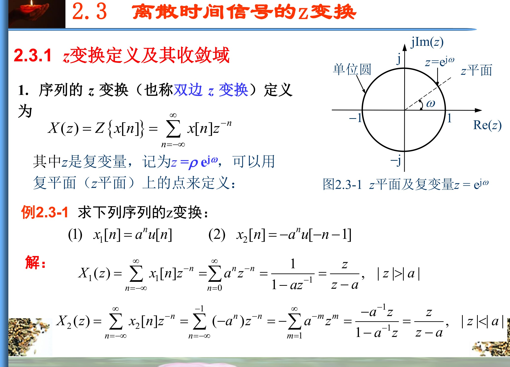
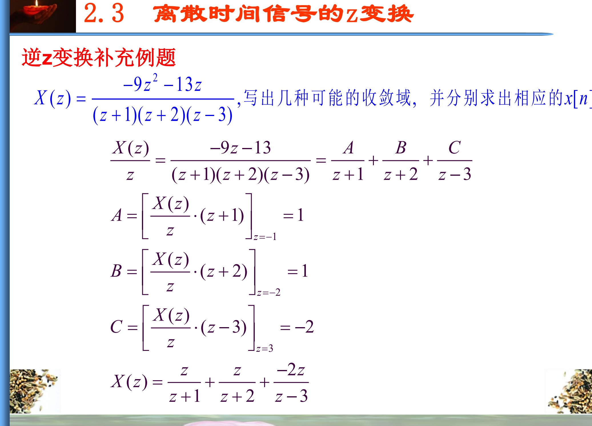
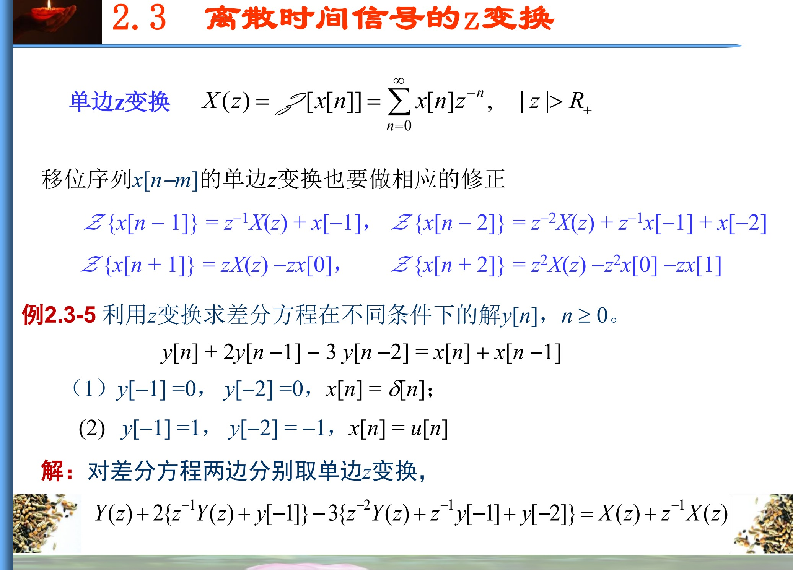
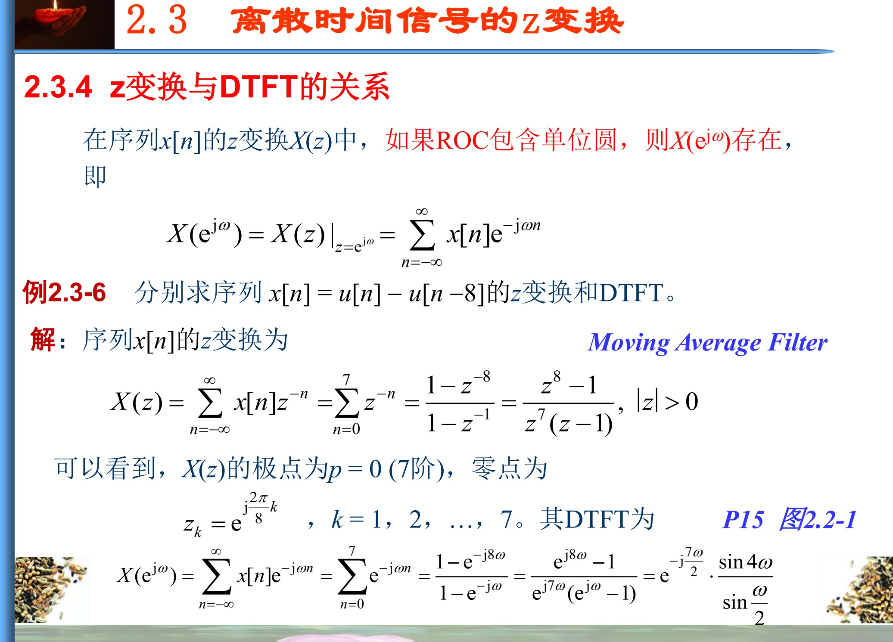

# 2.3节 离散时间信号的 $z$ 变换

## 一、为什么 DTFT 之后还需要 $z$ 变换

已有学习日志已经整理了 2.1 的序列基础和 2.2 的 DTFT。DTFT 把序列分解成不同频率的复指数，能够回答“序列包含哪些数字频率”。但有些序列的 DTFT 不按普通函数收敛，例如单位阶跃 $u[n]$；另外，DTFT 本身也不方便把收敛速度、左右边结构和差分方程初始状态放在同一套工具里处理。

$z$ 变换给 DTFT 增加了一个可以调节的径向因子。它不仅观察频率，还观察序列乘上不同指数权重后能否收敛。

本节的知识主线为

$$
\boxed{
\text{双边 }z\text{ 变换}
\longrightarrow
\text{收敛域 ROC}
\longrightarrow
\text{零极点}
\longrightarrow
\text{逆 }z\text{ 变换}
\longrightarrow
\text{变换性质}
\longrightarrow
\text{单边 }z\text{ 变换}
\longrightarrow
\text{DTFT 与系统分析}
}
$$

> 资料范围：教材印刷页 18—24（扫描 PDF 第 31—37 页）；PPT 导出 PDF 第 32—47 页。PPT 第 39 页提供了教材之外的多 ROC 逆变换补充例题，本文将其纳入典型题方法。

---

## 二、双边 $z$ 变换的定义与直觉

序列 $x[n]$ 的双边 $z$ 变换定义为

$$
\boxed{
X(z)=\mathcal Z\{x[n]\}
=\sum_{n=-\infty}^{\infty}x[n]z^{-n}.
}
$$

其中 $z$ 是复变量，可写成

$$
z=\rho e^{j\omega},\qquad \rho=|z|.
$$

于是

$$
z^{-n}=\rho^{-n}e^{-j\omega n},
$$

从而

$$
X(z)=\sum_{n=-\infty}^{\infty}
\bigl(x[n]\rho^{-n}\bigr)e^{-j\omega n}.
$$

这个式子揭示了直觉：固定半径 $\rho$ 时，$z$ 变换相当于先给序列乘上指数权重 $\rho^{-n}$，再求 DTFT。调节 $\rho$，可以让原本不收敛的序列衰减下来。

> 图源：PPT 导出 PDF 第 32 页，2.3.1 节。图中 $z=e^{j\omega}$ 是单位圆上的特殊情况；一般 $z$ 应写成 $z=\rho e^{j\omega}$。

---

## 三、ROC：为什么同一个分式还不能唯一确定序列

### 1. ROC 的定义

使级数

$$
\sum_{n=-\infty}^{\infty}x[n]z^{-n}
$$

收敛的全部 $z$ 值构成收敛域，简称 ROC。

对常见有理 $z$ 变换，ROC 通常是以原点为中心的圆环，而且不能包含极点。

### 2. 最重要的一对变换

对右边序列

$$
x_R[n]=a^nu[n],
$$

有

$$
X_R(z)=\sum_{n=0}^{\infty}(az^{-1})^n
=\frac{1}{1-az^{-1}}
=\frac{z}{z-a},
$$

等比级数要求

$$
\boxed{|z|>|a|.}
$$

而对左边序列

$$
x_L[n]=-a^nu[-n-1],
$$

也有相同的代数分式

$$
X_L(z)=\frac{z}{z-a},
$$

但收敛域变成

$$
\boxed{|z|<|a|.}
$$

因此必须把变换对写成

$$
\boxed{X(z)+\mathrm{ROC}.}
$$

只给 $z/(z-a)$，无法判断原序列向右延续还是向左延续。

### 3. 根据序列方向判断 ROC

| 序列类型 | 直观结构 | 常见 ROC 形状 |
|---|---|---|
| 有限长序列 | 只有有限个非零样本 | 通常为整个 $z$ 平面，可能排除 $0$ 或 $\infty$ |
| 右边序列 | 从某个时刻起向 $+\infty$ 延续 | 最外侧极点之外 |
| 左边序列 | 向 $-\infty$ 延续，到某时刻结束 | 最内侧极点之内 |
| 双边序列 | 同时向两边无限延续 | 两个极点圆之间的圆环 |

原点和无穷远点是否属于 ROC，要根据序列是否含正时间或负时间项具体判断，不能仅凭“有限长”三个字机械决定。

---

## 四、典型题：$x[n]=\alpha^{|n|}$ 的 $z$ 变换

这个序列向左右两边都延续，因此应拆成右边部分和左边部分：

$$
x[n]=\alpha^n,\qquad n\ge0,
$$

$$
x[n]=\alpha^{-n},\qquad n<0.
$$

于是

$$
X(z)
=\sum_{n=0}^{\infty}\alpha^nz^{-n}
+\sum_{n=-\infty}^{-1}\alpha^{-n}z^{-n}.
$$

右边部分为

$$
X_1(z)=\frac{z}{z-\alpha},
\qquad |z|>|\alpha|.
$$

左边部分令 $m=-n$，则

$$
X_2(z)=\sum_{m=1}^{\infty}(\alpha z)^m
=\frac{\alpha z}{1-\alpha z}
=-\frac{z}{z-1/\alpha},
$$

其收敛条件是

$$
|z|<\frac1{|\alpha|}.
$$

两部分必须有公共 ROC，因此要求

$$
0<|\alpha|<1.
$$

合并可得

$$
\boxed{
X(z)=
\frac{\left(\alpha-\dfrac1\alpha\right)z}
{(z-\alpha)\left(z-\dfrac1\alpha\right)},
\qquad
|\alpha|<|z|<\frac1{|\alpha|}.
}
$$

![教材双边序列及 x[n]=alpha 的绝对值次幂例题](../assets/chapter-2-3/textbook-p19-two-sided-sequence-roc.jpg)

> 图源：教材印刷第 19 页（扫描 PDF 第 32 页），例 2.3-2。教材图取 $\alpha=0.8$，所以 ROC 为 $0.8<|z|<1.25$。

本题真正要掌握的是：双边序列的 $z$ 变换存在，要求左边部分和右边部分的 ROC 有交集。若 $|\alpha|>1$，条件 $|z|>|\alpha|$ 与 $|z|<1/|\alpha|$ 无法同时满足，因此不存在统一的双边 $z$ 变换 ROC。

---

## 五、零点、极点与 ROC 的分工

若 $X(z)$ 是有理分式，可以写成

$$
X(z)=K\frac{\prod_i(z-z_i)}{\prod_k(z-p_k)}.
$$

- $z_i$ 是零点：代入后 $X(z_i)=0$；
- $p_k$ 是极点：分母在该点为零且没有被分子约去；
- ROC 中不能包含极点；
- 零极点决定代数结构，ROC 决定时间方向。

判断前必须先约去分子、分母的公共因子。被完全约去的因子不再是实际零点或极点。

例如有极点半径 $1,2,3$ 时，可能的非空 ROC 为

$$
|z|>3,
$$

$$
2<|z|<3,
$$

$$
1<|z|<2,
$$

$$
|z|<1.
$$

不同 ROC 会让部分分式项分别对应右边序列或左边序列，因此产生不同的 $x[n]$。

> 图源：PPT 导出 PDF 第 39 页。该页先完成部分分式展开，随后需要根据每个候选 ROC 选择各项的左右边变换对。

---

## 六、逆 $z$ 变换：做题时怎样选择方法

逆变换的目标是由 $X(z)$ 和 ROC 恢复 $x[n]$。常用三种方法。

### 1. 查变换对与部分分式展开

这是有理分式最常用的方法：

1. 先把 $X(z)$ 整理成常见形式；
2. 做部分分式展开；
3. 根据 ROC 判断每一项对应右边序列还是左边序列；
4. 把各项相加。

常见变换对必须连同 ROC 记忆：

$$
\frac{z}{z-a},\quad |z|>|a|
\quad\longleftrightarrow\quad
a^nu[n],
$$

$$
\frac{z}{z-a},\quad |z|<|a|
\quad\longleftrightarrow\quad
-a^nu[-n-1].
$$

部分分式中若出现常数项，它对应 $\delta[n]$。

### 2. 幂级数展开或长除法

把 $X(z)$ 展开成

$$
X(z)=\sum_nx[n]z^{-n},
$$

直接读取各次幂的系数。外侧 ROC 通常按 $z^{-1}$ 的非负次幂展开，内侧 ROC 通常按 $z$ 的正次幂展开。

这种方法适合求有限个样本或看清序列方向，但无限序列很难一次写出闭式。

### 3. 围线积分与留数

逆变换的理论公式为

$$
x[n]=\frac{1}{2\pi j}\oint_C X(z)z^{n-1}\,dz,
$$

其中闭合路径 $C$ 必须位于 ROC 内并围绕原点。计算时可用留数定理，但本章常规题优先使用部分分式法。

---

## 七、常用 $z$ 变换性质

设

$$
x[n]\xleftrightarrow{\mathcal Z}X(z),
\qquad
h[n]\xleftrightarrow{\mathcal Z}H(z).
$$

### 1. 线性

$$
ax[n]+bh[n]
\xleftrightarrow{\mathcal Z}
aX(z)+bH(z).
$$

结果 ROC 至少包含原 ROC 的交集；若发生零极点抵消，实际 ROC 可能扩大。

### 2. 双边变换的时移

$$
\boxed{
x[n-n_0]
\xleftrightarrow{\mathcal Z}
z^{-n_0}X(z).
}
$$

这是双边变换公式，不出现初值修正项；单边变换的移位公式不同。

### 3. 指数加权

$$
a^nx[n]
\xleftrightarrow{\mathcal Z}
X\left(\frac za\right).
$$

它会把 ROC 的半径按 $|a|$ 缩放。

### 4. 时间反褶

$$
x[-n]
\xleftrightarrow{\mathcal Z}
X(z^{-1}).
$$

ROC 的内外关系随之反转。

### 5. 卷积

$$
\boxed{
x[n]*h[n]
\xleftrightarrow{\mathcal Z}
X(z)H(z).
}
$$

这一性质将在 2.4 节直接产生系统函数关系 $Y(z)=X(z)H(z)$。

### 6. $z$ 域微分

$$
\boxed{
nx[n]
\xleftrightarrow{\mathcal Z}
-z\frac{dX(z)}{dz}.
}
$$

适合处理含 $n$、$n^2$ 等权重的序列。

### 7. 初值与终值

对因果序列，在相应极限存在时，

$$
x[0]=\lim_{z\to\infty}X(z).
$$

终值定理应写成

$$
\lim_{n\to\infty}x[n]
=\lim_{z\to1}(1-z^{-1})X(z),
$$

并要求终值确实存在；通常还需检查 $(1-z^{-1})X(z)$ 的极点位于单位圆内。若存在单位圆外极点或不衰减振荡，不能机械套用终值定理。

> PPT 第 42 页给出了初值、终值定理的简写。使用终值定理时必须补充极点/极限条件；否则可能得到形式上的数值，却不是实际序列终值。

---

## 八、为什么还需要单边 $z$ 变换

双边 $z$ 变换擅长描述完整序列及 ROC。求因果差分方程在 $n\ge0$ 的响应时，系统往往带有 $x[-1]$、$y[-1]$ 等初始状态，需要单边变换把它们显式保留下来。

单边 $z$ 变换定义为

$$
X_+(z)=\sum_{n=0}^{\infty}x[n]z^{-n}.
$$

由于求和只从 $n=0$ 开始，移位会越过求和边界，所以出现初值修正项：

$$
\boxed{
\mathcal Z_+\{x[n-1]\}
=z^{-1}X_+(z)+x[-1].
}
$$

$$
\boxed{
\mathcal Z_+\{x[n-2]\}
=z^{-2}X_+(z)+z^{-1}x[-1]+x[-2].
}
$$

向前移位时则减去已经越过边界的样本：

$$
\mathcal Z_+\{x[n+1]\}
=zX_+(z)-zx[0].
$$

> 图源：PPT 导出 PDF 第 44 页，随后以差分方程例 2.3-5 展示初始条件如何进入变换式。

易错点：

- 双边时移直接乘 $z^{-n_0}$；
- 单边时移必须检查越过 $n=0$ 边界的初始样本；
- 单边变换适合求带初始状态的因果差分方程，不能把它的移位公式和双边公式混用。

---

## 九、$z$ 变换与 DTFT 的关系

令

$$
z=e^{j\omega},
$$

也就是在 $z$ 平面的单位圆上取值，则 $z^{-n}=e^{-j\omega n}$。因此，如果 ROC 包含单位圆，

$$
\boxed{
X(e^{j\omega})
=X(z)\big|_{z=e^{j\omega}}.
}
$$

> 图源：PPT 导出 PDF 第 47 页，例 2.3-6 同时计算有限长矩形序列的 $z$ 变换和 DTFT。

这条关系把 2.2、2.3 和 2.4 连在一起：

$$
\boxed{
\mathrm{ROC}\text{ 包含单位圆}
\Longrightarrow
\text{可在单位圆上得到通常意义下的 DTFT}.
}
$$

对 LTI 系统，下一节将把脉冲响应的 $z$ 变换记为 $H(z)$，把它在单位圆上的取值记为频率响应 $H(e^{j\omega})$。稳定性也将转化为“$H(z)$ 的 ROC 是否包含单位圆”。

---

## 十、典型做题流程

### 题型 1：由 $x[n]$ 求 $X(z)$

1. 先判断有限长、右边、左边还是双边序列；
2. 按定义或常见变换对计算代数式；
3. 从等比级数收敛条件得到 ROC；
4. 求零极点并检查 ROC 不包含任何极点；
5. 双边序列分别求左右部分，最后取 ROC 交集。

### 题型 2：由 $X(z)$ 和 ROC 求 $x[n]$

1. 先约分并找出极点；
2. 根据 ROC 判断每个极点对应右边项还是左边项；
3. 对 $X(z)/z$ 或合适的标准形式做部分分式展开；
4. 逐项套用带 ROC 的变换对；
5. 检查所得序列方向与题给 ROC 一致。

### 题型 3：用性质求变换

1. 先写出基本变换对；
2. 识别移位、反褶、指数加权、乘 $n$ 或卷积；
3. 依次应用性质；
4. 每一步都同步更新 ROC，特别注意零极点抵消。

### 题型 4：求带初始条件的差分方程

1. 确认求解区间为 $n\ge0$；
2. 使用单边 $z$ 变换；
3. 对每个延迟项写出初值修正项；
4. 代入输入变换和初始值，解出 $Y_+(z)$；
5. 部分分式展开并逆变换；
6. 用 $n=0,1$ 的原差分方程回代检查。

---

## 十一、易错点汇总

1. **不能只写 $X(z)$ 而漏掉 ROC。** 同一个分式可能对应完全不同的序列。
2. **ROC 不能包含极点。** 极点是级数发散的位置。
3. **右边序列通常对应外侧 ROC，左边序列对应内侧 ROC。**
4. **双边序列的 ROC 是左右两部分 ROC 的交集。** 没有交集时，统一的双边 $z$ 变换不存在。
5. **零极点应在约分后判断。** 公共因子抵消会改变实际零极点和 ROC 边界。
6. **双边与单边时移公式不同。** 初始值修正项来自单边求和边界。
7. **终值定理不能只代 $z=1$。** 必须先确认终值存在并检查相关极点条件。
8. **DTFT 是 $z$ 变换在单位圆上的取值。** 前提是单位圆位于 ROC 中。
9. **有限长序列也要检查 $z=0$ 或 $z=\infty$。** 是否包含它们取决于序列含有哪些正、负下标项。
10. **部分分式系数算完还没有结束。** 必须依据 ROC 决定每一项是右边序列还是左边序列。

---

## 十二、与前后章节的连接

2.2 节的 DTFT 只看单位圆：

$$
X(e^{j\omega})=\sum_nx[n]e^{-j\omega n}.
$$

2.3 节把观察范围扩展到整个 $z$ 平面：

$$
X(z)=\sum_nx[n]z^{-n}.
$$

2.4 节则把输入、输出和脉冲响应放进这套工具：

$$
y[n]=x[n]*h[n]
\quad\Longleftrightarrow\quad
Y(z)=X(z)H(z).
$$

因此，$z$ 变换并不是孤立的新公式。它承担了中间桥梁的作用：一边连接 DTFT 和频率响应，一边连接卷积、差分方程、系统函数、因果性与稳定性。
