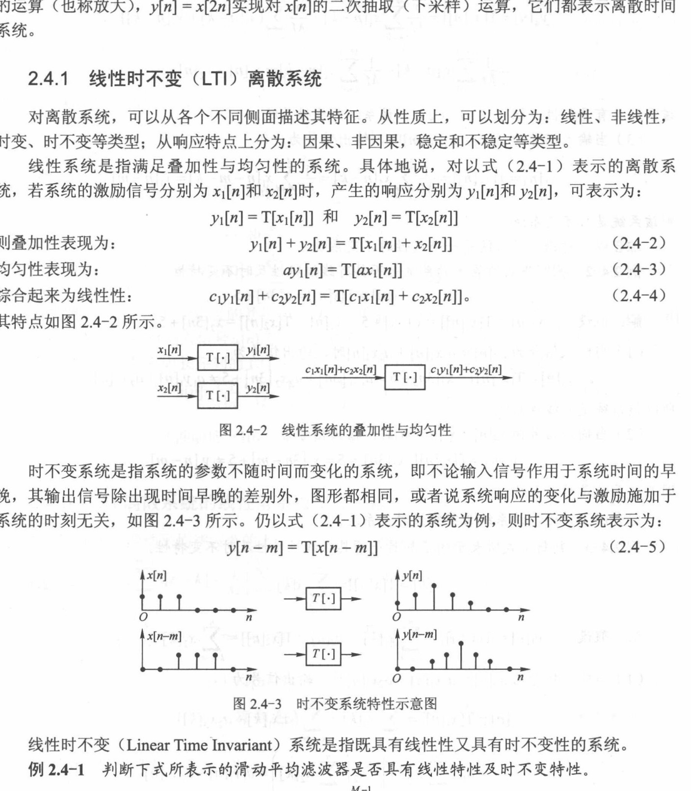
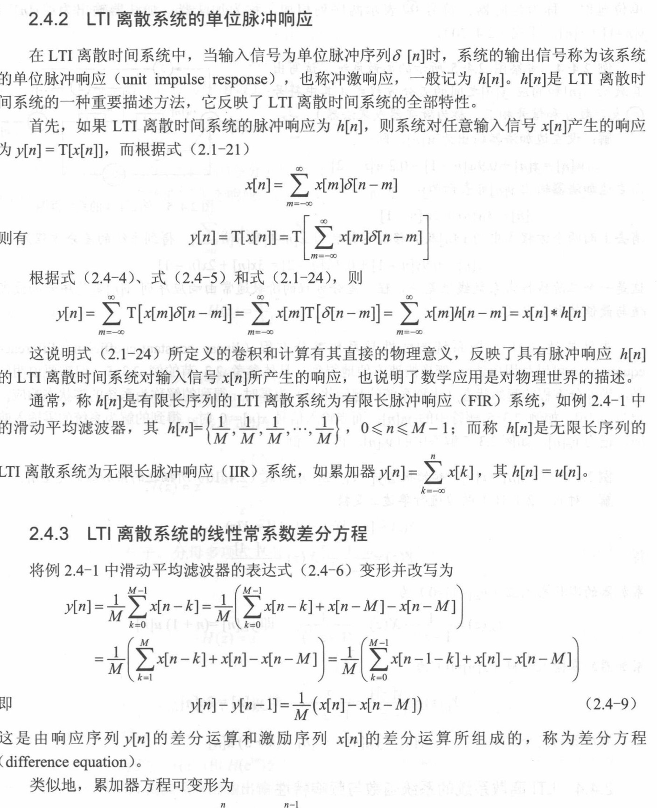
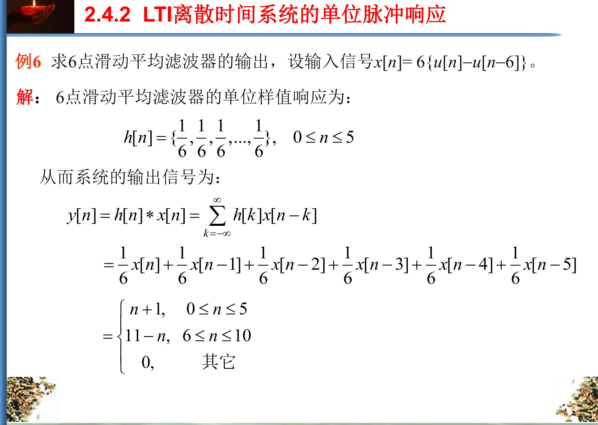
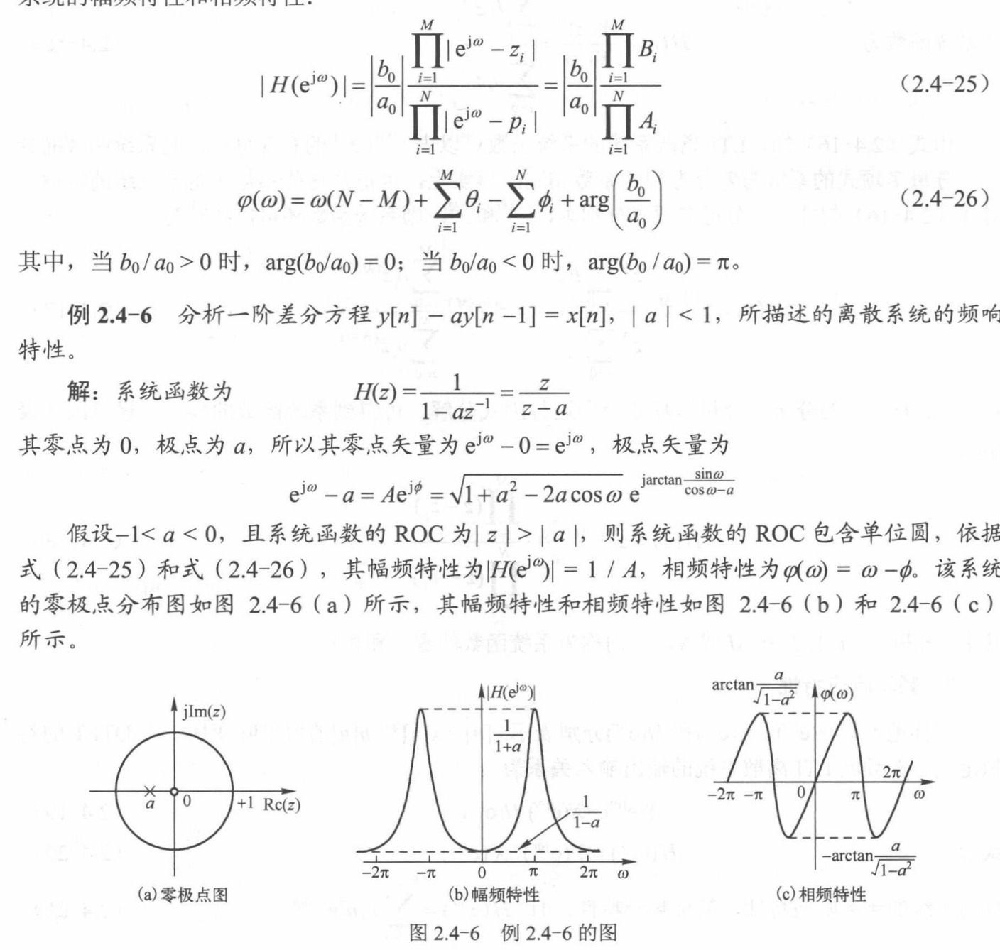
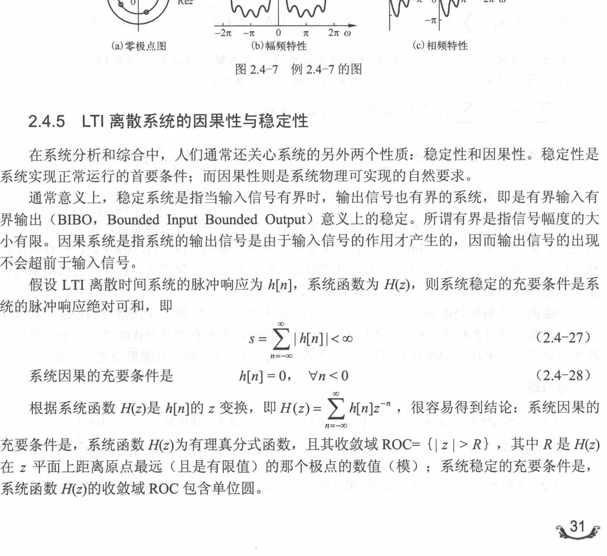

# 2.4节 离散时间系统

## 一、本节知识主线

本次学习范围是教材 **2.4 离散时间系统**。前面几节研究的是序列本身以及序列的 DTFT、$z$ 变换；本节开始研究一个序列经过处理后，怎样变成另一个序列：

$$
y[n]=T\{x[n]\}.
$$

其中，$x[n]$ 是输入（激励），$y[n]$ 是输出（响应），$T\{\cdot\}$ 表示系统的处理规则。

本节的逻辑不是一组互不相关的定义，而是一条连续的链：

$$
\boxed{
\text{系统性质}
\longrightarrow
\text{单位脉冲响应 }h[n]
\longrightarrow
\text{卷积}
\longrightarrow
\text{差分方程}
\longrightarrow
H(z)
\longrightarrow
H(e^{j\omega})
\longrightarrow
\text{因果性与稳定性}
}
$$

核心问题是：什么样的系统能够用一个简单对象完整描述？答案是 **线性时不变系统（LTI）**。对 LTI 系统，单位脉冲响应 $h[n]$ 能够决定零状态下的全部输入输出关系。

> 资料范围：教材印刷页 24—33（原扫描 PDF 第 37—46 页）；PPT 导出 PDF 第 49—76 页。两份资料的内容主线一致，但部分例题编号不同，本文按知识点对应，不按编号强行对应。

---

## 二、离散时间系统的四种基本性质

### 1. 线性：能否先拆开处理，再把结果相加

如果

$$
T\{x_1[n]\}=y_1[n],\qquad T\{x_2[n]\}=y_2[n],
$$

那么线性系统必须对任意输入、任意常数 $c_1,c_2$ 满足

$$
\boxed{
T\{c_1x_1[n]+c_2x_2[n]\}
=c_1T\{x_1[n]\}+c_2T\{x_2[n]\}.
}
$$

它同时包含：

- 可加性：分别处理后相加，等于相加后一起处理；
- 均匀性：输入扩大 $c$ 倍，输出也扩大 $c$ 倍。

最快的排除方法是检查零输入。线性系统一定满足

$$
T\{0\}=0.
$$

因此，只要系统中出现与输入无关的固定附加量，如

$$
y[n]=3x[2n]+1,
$$

就有 $T\{0\}=1$，可以立即判为非线性。但要注意：$x[2n]$ 这种下标变换本身不破坏线性。

### 2. 时不变：同一个处理规律会不会随时间改变

若

$$
T\{x[n]\}=y[n],
$$

把输入延迟 $m$ 后，时不变系统应只让输出同步延迟 $m$：

$$
\boxed{T\{x[n-m]\}=y[n-m].}
$$

做题时固定比较两条路径：

1. **输入先延迟**：令 $x_m[n]=x[n-m]$，再严格套用原系统规则，计算 $T\{x_m[n]\}$；
2. **输出后延迟**：在原输出表达式中把每个 $n$ 换成 $n-m$，计算 $y[n-m]$。

两条结果对任意 $x[n]$、任意整数 $m$ 都相同，才是时不变系统。

> 图源：教材印刷第 25 页（扫描 PDF 第 38 页），图 2.4-2、图 2.4-3。

#### 典型题 1：$y[n]=3x[2n]+1$

非线性已经由 $T\{0\}=1$ 得到。判断时不变性时，令 $x_m[n]=x[n-m]$。

输入先延迟：

$$
T\{x_m[n]\}=3x_m[2n]+1=3x[2n-m]+1.
$$

输出后延迟：

$$
y[n-m]=3x[2(n-m)]+1=3x[2n-2m]+1.
$$

两者一般不相等，所以该系统时变。

易错点：第一条路径中，原系统仍然读取“新输入的第 $2n$ 项”，所以先写 $x_m[2n]$，然后才由 $x_m[k]=x[k-m]$ 得到 $x[2n-m]$。只有“输出后延迟”才把输出公式中的 $n$ 整体替换成 $n-m$。

#### 典型题 2：$y[n]=x[2n-1]$

该系统的四项结论为

$$
\boxed{\text{线性、时变、非因果、BIBO 稳定}.}
$$

线性是因为

$$
T\{ax_1[n]+bx_2[n]\}
=ax_1[2n-1]+bx_2[2n-1].
$$

时不变性的两条路径分别为

$$
T\{x_m[n]\}=x[2n-1-m],
$$

$$
y[n-m]=x[2n-2m-1].
$$

两者一般不相等，因此时变。

在输出时刻 $n$，系统读取输入时刻 $2n-1$。因果性要求 $2n-1\le n$ 对所有 $n$ 成立，但当 $n>1$ 时不成立。例如

$$
y[2]=x[3]
$$

需要未来输入，所以系统非因果。

若输入有界，即 $|x[n]|\le B<\infty$，则

$$
|y[n]|=|x[2n-1]|\le B,
$$

所以系统 BIBO 稳定。

### 3. 因果：当前输出是否用到了未来输入

一般系统的定义是：$y[n_0]$ 只能依赖 $x[n]$ 在 $n\le n_0$ 时的值。

判断含下标变换的系统时，可以直接比较“所读取的输入下标”和“当前输出时刻”。只要存在一个时刻读取了未来输入，整个系统就不是因果系统。

### 4. BIBO 稳定：有界输入是否一定产生有界输出

BIBO 是 bounded input, bounded output 的缩写。定义是：如果对每一个满足

$$
|x[n]|\le B_x<\infty
$$

的输入，都能找到有限常数 $B_y$，使

$$
|y[n]|\le B_y<\infty,
$$

则系统 BIBO 稳定。

“输入有界”指幅值有统一的有限上界，不代表输入必须趋于零；“系统稳定”也不是只检查某一个特殊输入。

---

## 三、为什么单位脉冲响应能够描述整个 LTI 系统

### 1. 单位脉冲响应的意义

给系统输入单位脉冲 $\delta[n]$，并令系统初始状态为零，得到的输出称为单位脉冲响应：

$$
\boxed{h[n]=T\{\delta[n]\}.}
$$

$h[n]$ 可以理解为：在 $n=0$ 时刻只输入一次以后，这次输入对后续各时刻产生怎样的影响。

### 2. 任意序列都能拆成许多移位脉冲

任意输入序列可以表示为

$$
x[n]=\sum_{m=-\infty}^{\infty}x[m]\delta[n-m].
$$

其中，$x[m]\delta[n-m]$ 表示在时刻 $m$ 放入一个高度为 $x[m]$ 的脉冲。

对 LTI 系统：

- 时不变性给出 $T\{\delta[n-m]\}=h[n-m]$；
- 线性给出 $T\{x[m]\delta[n-m]\}=x[m]h[n-m]$；
- 再把所有输入样本的贡献相加。

因此零状态响应为

$$
\boxed{
y_{zs}[n]
=\sum_{m=-\infty}^{\infty}x[m]h[n-m]
=x[n]*h[n].
}
$$

这就是卷积和。每一项 $x[m]h[n-m]$ 的含义是：第 $m$ 个输入样本对当前第 $n$ 个输出的贡献。

> 图源：教材印刷第 27 页（扫描 PDF 第 40 页），2.4.2 与 2.4.3 节交界处。

### 3. FIR 与 IIR

- 若 $h[n]$ 只有有限个非零样本，系统是有限长脉冲响应系统（FIR）；
- 若 $h[n]$ 有无限多个非零样本，系统是无限长脉冲响应系统（IIR）。

FIR/IIR 看的是 $h[n]$ 的长度，不直接等同于稳定/不稳定。

例如 $h[n]=a^nu[n]$ 在 $0<|a|<1$ 时虽然无限长，但绝对值不断衰减，系统可以稳定。累加器的 $h[n]=u[n]$ 不衰减，因而不稳定。

---

## 四、典型题：六点滑动平均为什么得到三角形输出

六点滑动平均系统为

$$
y[n]=\frac{1}{6}\sum_{k=0}^{5}x[n-k].
$$

它的脉冲响应是

$$
h[n]=\frac{1}{6}\bigl(u[n]-u[n-6]\bigr),
$$

即 $h[0],\ldots,h[5]$ 都等于 $1/6$，其他位置为零。

题目给出的输入为

$$
x[n]=6\bigl(u[n]-u[n-6]\bigr),
$$

因此 $x[0],\ldots,x[5]$ 都等于 6，其他位置为零。

> 图源：PPT 导出 PDF 第 58 页。PPT 标为“例 6”，对应 2.4.2 的滑动平均计算。

卷积展开为

$$
y[n]=\frac16\bigl(x[n]+x[n-1]+x[n-2]+x[n-3]+x[n-4]+x[n-5]\bigr).
$$

计算每个 $y[n]$ 时，数一数这六项中有几个非零的 6。每出现一个非零项，对输出的贡献就是

$$
\frac16\times6=1.
$$

逐项计算：

| $n$ | 窗口中的非零输入 | 非零项数 | $y[n]$ |
|---:|---|---:|---:|
| 0 | $x[0]$ | 1 | 1 |
| 1 | $x[1],x[0]$ | 2 | 2 |
| 2 | $x[2],x[1],x[0]$ | 3 | 3 |
| 3 | $x[3],x[2],x[1],x[0]$ | 4 | 4 |
| 4 | $x[4],\ldots,x[0]$ | 5 | 5 |
| 5 | $x[5],\ldots,x[0]$ | 6 | 6 |
| 6 | $x[5],\ldots,x[1]$ | 5 | 5 |
| 7 | $x[5],\ldots,x[2]$ | 4 | 4 |
| 8 | $x[5],x[4],x[3]$ | 3 | 3 |
| 9 | $x[5],x[4]$ | 2 | 2 |
| 10 | $x[5]$ | 1 | 1 |

所以

$$
y[n]=n+1,\qquad 0\le n\le5,
$$

$$
y[n]=11-n,\qquad 6\le n\le10,
$$

其他时刻 $y[n]=0$。

最容易漏掉的是 $n=6$ 以后。虽然此时当前输入 $x[n]$ 已经为零，但滑动窗口中仍然保留了过去的非零样本，因此输出不会立刻归零。

有限长卷积还可检查输出长度。若两个有限长序列的长度分别为 $L_x,L_h$，则完整卷积长度为

$$
\boxed{L_y=L_x+L_h-1.}
$$

本题 $L_x=L_h=6$，所以输出长度为 $11$，恰好位于 $n=0,\ldots,10$。

---

## 五、为什么由卷积继续引出差分方程

卷积给出完整输入输出关系，但实际逐点计算时，常常可以利用以前已经算出的输出。

### 1. 累加器

累加器为

$$
y[n]=\sum_{k=-\infty}^{n}x[k].
$$

前一时刻已经算出过去所有输入之和，因此

$$
\boxed{y[n]-y[n-1]=x[n].}
$$

### 2. $M$ 点滑动平均

当前窗口相对前一窗口只增加 $x[n]$，并移除 $x[n-M]$，所以

$$
\boxed{
y[n]-y[n-1]
=\frac1M\bigl(x[n]-x[n-M]\bigr).
}
$$

虽然该式出现过去输出 $y[n-1]$，它描述的仍然是 FIR 滑动平均器。判断 FIR/IIR 应以约去公共因子后的 $h[n]$ 为准，不能只看实现公式里是否出现反馈。

### 3. 一般线性常系数差分方程

教材写成

$$
\boxed{
\sum_{i=0}^{N}a_i y[n-i]
=\sum_{i=0}^{M}b_i x[n-i],\qquad a_0\ne0.
}
$$

$a_i,b_i$ 是固定系数。左边表示当前输出和过去输出之间的关系，右边表示当前、过去输入对输出的作用。

这类方程能描述本节大量常见 LTI 系统，但并不是所有 LTI 系统都一定具有有限阶线性常系数差分方程。

---

## 六、全部响应、零状态响应与零输入响应

递推系统内部可能已经存有过去的值。因此当前输出可能有两个来源：

$$
\boxed{y[n]=y_{zs}[n]+y_{zi}[n].}
$$

- $y_{zs}[n]$：初始状态全部置零，仅由当前输入产生；
- $y_{zi}[n]$：输入置零，仅由初始状态延续产生。

卷积

$$
y_{zs}[n]=x[n]*h[n]
$$

给出的是零状态响应，不自动包含额外指定的初始状态。

教材的累加器例题为

$$
y[n]-y[n-1]=x[n],\qquad x[n]=u[n],\qquad y[-1]=2.
$$

零状态响应是

$$
y_{zs}[n]=(n+1)u[n],
$$

零输入响应是

$$
y_{zi}[n]=2u[n],
$$

全部响应为

$$
y[n]=(n+3)u[n].
$$

还应区分另一组术语：自由响应 $y_h[n]$ 是齐次方程的解，强迫响应 $y_p[n]$ 是某个特解。这是按数学解法分类；零输入/零状态是按响应来源分类，二者不能简单一一对应。

---

## 七、系统函数：把差分和卷积变成代数运算

因为 $z$ 变换具有移位性质和卷积定理，在零状态条件下

$$
Y(z)=X(z)H(z),
$$

所以系统函数定义为

$$
\boxed{
H(z)=\frac{Y(z)}{X(z)}=\mathcal Z\{h[n]\}.
}
$$

对一般线性常系数差分方程，零状态系统函数为

$$
\boxed{
H(z)=
\frac{\displaystyle\sum_{i=0}^{M}b_i z^{-i}}
{\displaystyle\sum_{i=0}^{N}a_i z^{-i}}.
}
$$

这个公式的使用条件不能漏：

1. 计算 $H(z)=Y(z)/X(z)$ 时讨论的是零状态输入输出关系；
2. 已知非零初始状态并求全部响应时，要用单边 $z$ 变换或另求零输入响应；
3. 只写代数分式不能唯一确定双边序列，还必须给出 ROC；
4. 判断零极点之前应先约去分子分母的公共因子。

例如

$$
H(z)=\frac{1}{1-az^{-1}}=\frac{z}{z-a}.
$$

代数式的零点为 $0$、极点为 $a$。若取因果系统，则

$$
h[n]=a^nu[n],\qquad \mathrm{ROC}:|z|>|a|.
$$

---

## 八、频率响应：系统对每一种数字频率做了什么

给 LTI 系统输入复指数

$$
x[n]=e^{j\omega n},
$$

利用卷积可得

$$
y[n]
=e^{j\omega n}\sum_{k=-\infty}^{\infty}h[k]e^{-j\omega k}
=H(e^{j\omega})e^{j\omega n}.
$$

因此，LTI 系统不会把一个复指数变成另一个频率，只会改变它的幅度和相位：

$$
\boxed{
H(e^{j\omega})
=\sum_{n=-\infty}^{\infty}h[n]e^{-j\omega n}
=|H(e^{j\omega})|e^{j\varphi(\omega)}.
}
$$

- $|H(e^{j\omega})|$：该频率被放大或衰减多少；
- $\varphi(\omega)$：该频率发生多少相移。

系统函数与频率响应的关系为

$$
\boxed{H(e^{j\omega})=H(z)\big|_{z=e^{j\omega}}.}
$$

在本节通常采用的绝对收敛框架下，使用这个关系需要 $H(z)$ 的 ROC 包含单位圆。

---

## 九、零极点矢量作图法：只抓住距离和角度

先把约分后的系统函数写成

$$
H(z)=K\frac{\prod_i(z-z_i)}{\prod_k(z-p_k)},
$$

其中 $z_i$ 是零点，$p_k$ 是极点。考察频率 $\omega$ 时，把

$$
P=e^{j\omega}
$$

看作单位圆上的一个点。

- 零点矢量：从零点 $z_i$ 指向 $P$；
- 极点矢量：从极点 $p_k$ 指向 $P$。

幅度只看矢量长度：

$$
\boxed{
|H(e^{j\omega})|
=|K|\frac{\text{各零点矢量长度之积}}
{\text{各极点矢量长度之积}}.
}
$$

相位只看矢量角度：

$$
\boxed{
\varphi(\omega)
=\arg K
+\text{各零点矢量角度之和}
-\text{各极点矢量角度之和}.
}
$$

最重要的直觉：

$$
\boxed{\text{靠近零点，幅度被压低；靠近极点，幅度被抬高。}}
$$

频率点沿单位圆逆时针移动：

- $\omega=0$ 对应 $z=1$，即单位圆最右端；
- $\omega=\pi/2$ 对应 $z=j$，即单位圆最上端；
- $\omega=\pi$ 对应 $z=-1$，即单位圆最左端。

因此：

- 零点在 $z=1$ 会完全抑制直流 $\omega=0$；
- 零点在 $z=-1$ 会完全抑制最高数字频率 $\omega=\pi$；
- 极点越靠近单位圆上的某个频率位置，该频率附近的增益通常越大。

> 图源：教材印刷第 30 页（扫描 PDF 第 43 页），例 2.4-6 与图 2.4-6。

例如

$$
H(z)=\frac{1}{1-az^{-1}}=\frac{z}{z-a}.
$$

零点在原点，极点在 $a$。由于单位圆上的点到原点距离恒为 1，幅度只需看它到极点的距离：

$$
|H(e^{j\omega})|=\frac{1}{|e^{j\omega}-a|}.
$$

若 $0<a<1$，极点靠近单位圆右端，即靠近 $\omega=0$，所以低频增益较大；若 $-1<a<0$，极点靠近单位圆左端，即靠近 $\omega=\pi$，所以高频增益较大。

做粗略幅频图时，先判断零点造成的凹陷和极点造成的峰值，不必一开始就陷入复杂的反正切计算。只有题目明确要求相频表达式时，再计算各矢量角度。

---

## 十、LTI 系统的因果性与稳定性

> 图源：教材印刷第 31 页（扫描 PDF 第 44 页），2.4.5 节。

### 1. 因果性的 $h[n]$ 条件

卷积写成

$$
y[n]=\sum_{k=-\infty}^{\infty}h[k]x[n-k].
$$

如果某个 $k<0$ 时 $h[k]\ne0$，输出就会使用 $x[n-k]=x[n+|k|]$，即未来输入。因此对 LTI 系统，

$$
\boxed{\text{因果}\quad\Longleftrightarrow\quad h[n]=0,\ n<0.}
$$

对有理系统函数，因果系统的 ROC 位于最外侧有限极点之外，并延伸到无穷远点。

### 2. 稳定性的 $h[n]$ 条件

若 $|x[n]|\le B_x$，则

$$
|y[n]|
\le \sum_k|h[k]|\,|x[n-k]|
\le B_x\sum_k|h[k]|.
$$

因此，LTI 系统 BIBO 稳定的充要条件是

$$
\boxed{
\sum_{n=-\infty}^{\infty}|h[n]|<\infty.
}
$$

在 $z$ 域中，这等价于 $H(z)$ 的 ROC 包含单位圆。

### 3. 因果且稳定时的极点条件

对于约去公共因子后的有理系统函数：

- 因果要求 ROC 位于最外侧极点之外；
- 稳定要求 ROC 包含单位圆。

两者同时成立，就要求所有有限极点严格位于单位圆内：

$$
\boxed{|p_k|<1.}
$$

这个结论不能脱离“因果有理系统”前提。非因果系统即使有单位圆外极点，只要其 ROC 包含单位圆，仍可能稳定。

### 4. 四个概念不要混用

| 概念 | 判断对象 | 关键问题 |
|---|---|---|
| 线性 | 运算规则 $T\{\cdot\}$ | 是否满足叠加性和均匀性 |
| 时不变 | 输入、输出的平移关系 | 输入延迟后，输出是否同步延迟 |
| 因果 | 输入下标或 $h[n]$ 的支撑 | 当前输出是否使用未来输入 |
| 稳定 | 所有有界输入或 $h[n]$ | 有界输入是否必然产生有界输出 |

一个系统完全可以同时是线性、时变、非因果但稳定，例如 $y[n]=x[2n-1]$。四项性质必须分别判断。

---

## 十一、典型做题流程

### 题型 1：直接给出 $y[n]=T\{x[n]\}$

1. 线性：代入 $ax_1+bx_2$；可先用 $T\{0\}=0$ 快速排除；
2. 时不变：比较 $T\{x[n-m]\}$ 与 $y[n-m]$；
3. 因果：检查当前 $y[n]$ 是否使用下标大于 $n$ 的输入；
4. 稳定：从 $|x[n]|\le B$ 出发，证明能否得到统一的有限输出上界。

### 题型 2：给出 $h[n]$

1. 求输出：$y_{zs}[n]=x[n]*h[n]$；
2. 因果：检查 $n<0$ 时 $h[n]$ 是否全为零；
3. 稳定：检查 $\sum|h[n]|$ 是否收敛；
4. FIR/IIR：检查非零样本个数是有限还是无限；
5. 求系统函数或频响：分别对 $h[n]$ 作 $z$ 变换或 DTFT。

### 题型 3：给出差分方程

1. 先确认题目要求零状态响应、零输入响应还是全部响应；
2. 零状态下作 $z$ 变换求 $H(z)$；
3. 因果系统根据最外侧极点确定外侧 ROC；
4. 用逆 $z$ 变换求 $h[n]$，或用 $Y(z)=X(z)H(z)$ 求零状态输出；
5. 有初始条件时，用单边 $z$ 变换或单独计算 $y_{zi}[n]$；
6. 判断稳定性时检查 ROC 是否包含单位圆。

### 题型 4：给出零极点图或要求频率响应

1. 先确认零点、极点及其重数；
2. 检查 ROC 是否包含单位圆；
3. 令 $z=e^{j\omega}$；
4. 用“零点距离之积除以极点距离之积”看幅度；
5. 用“零点角度相加、极点角度相减”看相位；
6. 优先检查 $\omega=0,\pi/2,\pi$ 等关键位置，再补充曲线趋势。

---

## 十二、资料表述补充与易错点

1. **$H(z)=Y(z)/X(z)$ 对应零状态关系。** 若系统有非零初始状态，全部输出不能直接只写成 $X(z)H(z)$。
2. **分式必须和 ROC 一起看。** 同一个代数分式可能对应因果、反因果或双边的不同 $h[n]$。
3. **出现过去输出不必然是 IIR。** 滑动平均的递推实现中出现 $y[n-1]$，但约去公共因子后其 $h[n]$ 仍为有限长。
4. **零点与极点先约分再判断。** 可消去的公共因子不是系统实际保留的零极点。
5. **“极点都在单位圆内则稳定”有前提。** 它适用于因果、约分后的有理系统；一般稳定条件仍是 ROC 包含单位圆。
6. **频率响应是在单位圆上观察系统函数。** 在本节通常框架下，应先确认单位圆属于 ROC。
7. **FIR 不等于无反馈实现，IIR 也不等于一定不稳定。** 分类最终看 $h[n]$。
8. **因果性要对所有时刻成立。** 某个系统在一部分 $n$ 上只用过去输入，不足以证明整个系统因果。
9. **判断时不变不能凭公式中是否显含 $n$。** 必须实际比较两条延迟路径。
10. **自由/强迫响应与零输入/零状态响应不是同一划分。** 前者按方程解法分类，后者按响应来源分类。

---

## 十三、应达到的掌握程度

完成本节后，应能不查资料完成以下任务：

1. 对一个输入输出表达式分别判断线性、时不变、因果和 BIBO 稳定；
2. 解释为什么 LTI 系统的任意零状态响应等于 $x[n]*h[n]$；
3. 手算短序列卷积，特别是滑动平均的重叠计数；
4. 区分 FIR/IIR、零状态/零输入、自由/强迫响应；
5. 从差分方程求零状态系统函数，并结合 ROC 解释因果性；
6. 由 $H(z)$ 得到 $H(e^{j\omega})$，用零极点距离和角度解释幅频、相频特性；
7. 在 $h[n]$、$H(z)$ 和极点三个层面判断 LTI 系统的因果性与稳定性。

最值得建立的整体认识是：

$$
\boxed{
h[n]
\xleftrightarrow{\ \mathcal Z\ }
H(z),
\qquad
H(e^{j\omega})=H(z)\big|_{z=e^{j\omega}}
}
$$

$h[n]$ 告诉我们一次输入的影响如何随时间延续；$H(z)$ 把卷积和递推变成代数关系；$H(e^{j\omega})$ 告诉我们系统怎样改变不同频率。因果性和稳定性则分别约束这种影响能否提前出现、能否无限积累。
