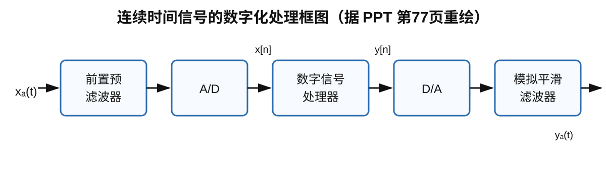
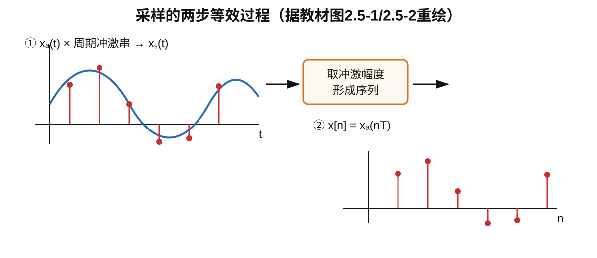
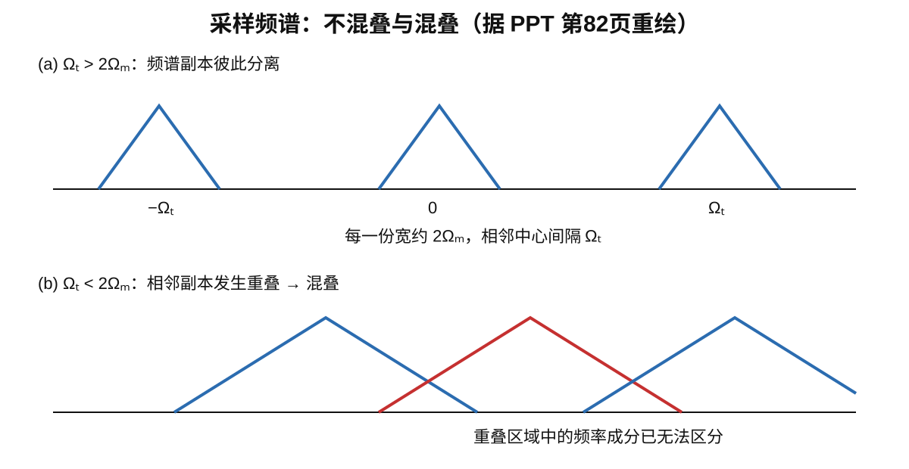
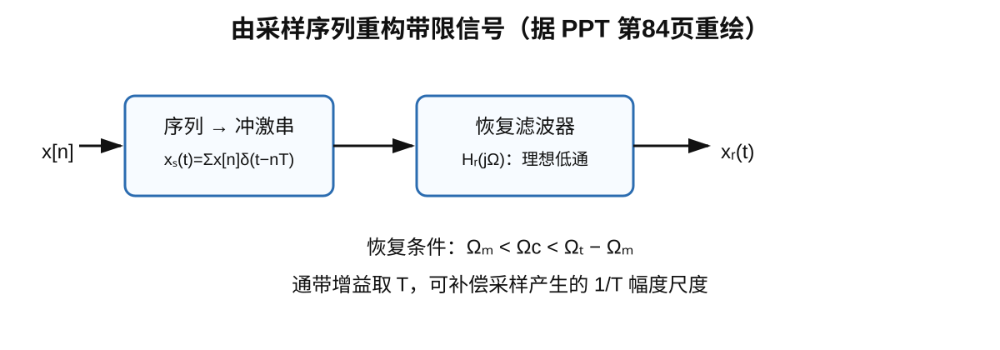
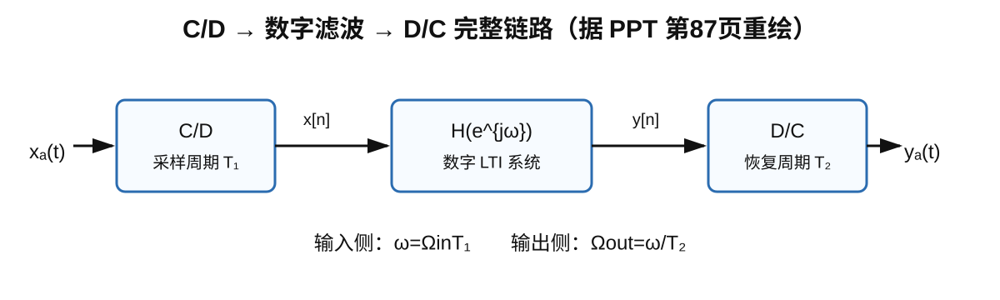
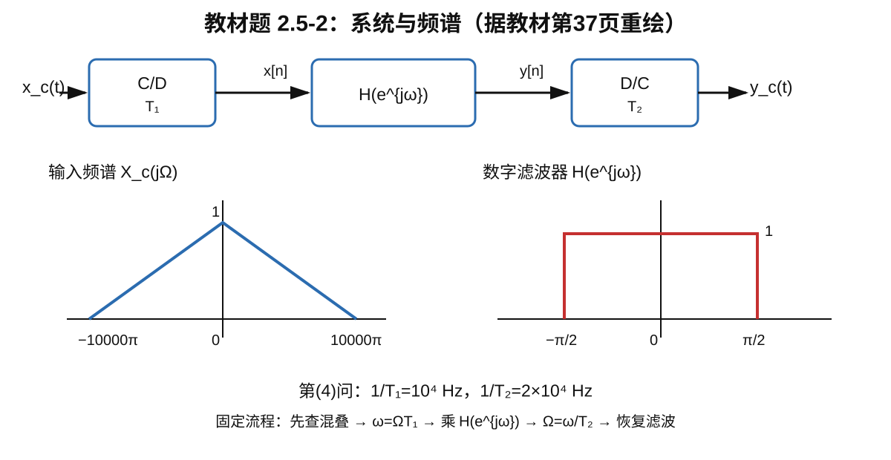

# 2.5节 离散时间系统处理连续时间信号

## 一、本节知识主线

前面 2.1～2.4 节研究的是离散时间世界中的对象：序列 $x[n]$、DTFT、$z$ 变换、LTI 系统和频率响应 $H(e^{j\omega})$。2.5 节第一次把这些知识接回真实的连续时间信号。

本节真正解决的是：

> **连续时间信号怎样进入数字系统，经过离散时间系统处理以后，又怎样回到连续时间世界？**

整条链路是

$$
\boxed{
x_a(t)
\longrightarrow \text{C/D（采样）}
\longrightarrow x[n]
\longrightarrow H(e^{j\omega})
\longrightarrow y[n]
\longrightarrow \text{D/C（重构）}
\longrightarrow y_a(t)
}
$$

实际系统还包含输入端抗混叠滤波和输出端平滑滤波：

$$
\boxed{
\text{前置预滤波}
\rightarrow A/D
\rightarrow \text{数字信号处理器}
\rightarrow D/A
\rightarrow \text{模拟平滑滤波}
}
$$

> 据 PPT 第 77 页重绘。

本节的逻辑链是：

$$
\boxed{
\text{为什么需要采样}
\rightarrow
\text{采样在频域发生什么}
\rightarrow
\text{为什么会混叠}
\rightarrow
\text{采样频率至少多大}
\rightarrow
\text{数字域怎样处理}
\rightarrow
\text{怎样恢复连续信号}
}
$$

> 资料范围：教材 2.5 节及练习 2.5-2；PPT 第 77～87 页。两者主线一致，PPT 更强调框图和频谱图，教材对采样频谱与恢复条件写得更完整。

---

## 二、2.5.1 连续时间信号为什么要先数字化

现实中的语音、电压、传感器波形通常写成连续时间信号

$$
x_a(t),
$$

数字处理器只能处理序列

$$
x[n].
$$

因此在使用前面学过的卷积、DTFT、差分方程和频率响应之前，必须先解决连续域与离散域之间的接口问题。

### 1. 前置预滤波器：先限制带宽，再采样

PPT 给出的理想前置低通可写为

$$
H_{aa}(j\Omega)=
\begin{cases}
1,&|\Omega|<\Omega_T/2,\\
0,&|\Omega|\ge\Omega_T/2,
\end{cases}
$$

其中

$$
\boxed{\Omega_T=\frac{2\pi}{T}}
$$

是采样角频率。

它的作用不是“把信号变成数字信号”，而是先限制模拟输入的最高频率，防止后续采样发生混叠，因此也称 **抗混叠滤波器**。

实际信号和实际滤波器都很难做到理想带限，因此工程中通常不会把采样率刚好卡在理论下限，而会留出过渡带和安全余量。

### 2. A/D：采样、量化、编码

A/D 通常包含：

- 采样：时间离散化；
- 量化：幅值离散化；
- 编码：用数字码表示量化值。

本节主要研究采样理论，暂不展开量化误差。

### 3. 数字信号处理器

进入数字域后，信号成为 $x[n]$。对 LTI 系统：

$$
\boxed{Y(e^{j\omega})=H(e^{j\omega})X(e^{j\omega}).}
$$

这就是综合频谱题中“数字滤波”那一步的依据。

### 4. D/A 与平滑滤波

数字系统输出 $y[n]$ 后，需要重新生成连续时间信号。实际 D/A 常产生阶梯状或保持型波形，含有额外高频成分，所以还要经过模拟平滑滤波器。

理论分析中，教材把“序列 → 冲激串 → 理想低通恢复”抽象成理想 D/C。

---

## 三、2.5.2 采样：先分清 $x_a(t)$、$x_s(t)$ 和 $x[n]$

这是本节最容易混淆的三个符号。

### 1. 第一步：连续信号乘周期冲激串

定义采样冲激串

$$
\delta_T(t)=\sum_{n=-\infty}^{\infty}\delta(t-nT).
$$

连续信号与它相乘：

$$
\begin{aligned}
x_s(t)
&=x_a(t)\delta_T(t)\\
&=\sum_{n=-\infty}^{\infty}x_a(nT)\delta(t-nT).
\end{aligned}
$$

此时 $x_s(t)$ 仍是连续时间的冲激串表示。

### 2. 第二步：取出冲激幅度形成序列

$$
\boxed{x[n]=x_a(nT).}
$$

三者区别：

| 符号 | 所处世界 | 含义 |
|---|---|---|
| $x_a(t)$ | 连续时间 | 原模拟信号 |
| $x_s(t)$ | 连续时间 | 冲激采样信号 |
| $x[n]$ | 离散时间 | 样值序列 |

> 据教材图 2.5-1、2.5-2 重绘。

因此理想 C/D 可以概括成

$$
\boxed{x_a(t)\xrightarrow{\ C/D,T\ }x[n]=x_a(nT).}
$$

---

## 四、为什么一采样，频谱会周期复制

设

$$
x_a(t)\longleftrightarrow X_a(j\Omega),
$$

$$
x_s(t)\longleftrightarrow X_s(j\Omega),
$$

$$
x[n]\longleftrightarrow X(e^{j\omega}).
$$

注意：

- $\Omega$：连续时间角频率，单位 rad/s；
- $\omega$：数字角频率，教材记为 rad，常理解为 rad/sample。

### 1. 冲激采样信号的频谱

教材推导得到

$$
\boxed{
X_s(j\Omega)
=\frac1T\sum_{k=-\infty}^{\infty}
X_a\bigl[j(\Omega-k\Omega_T)\bigr],
\qquad
\Omega_T=\frac{2\pi}{T}.
}
$$

物理意义：

> **采样后，原频谱每隔 $\Omega_T$ 复制一份，同时幅度乘 $1/T$。**

所以采样在频域的本质不是“删点”，而是制造无穷多个周期频谱副本。

### 2. 连续频率与数字频率的尺度关系

教材比较 $X_s(j\Omega)$ 和 DTFT 后得到

$$
\boxed{
X(e^{j\omega})\big|_{\omega=\Omega T}=X_s(j\Omega)
}
$$

因此

$$
\boxed{\omega=\Omega T},
\qquad
\boxed{\Omega=\frac{\omega}{T}}.
$$

这就是综合画图题最常用的横轴变换。

又因为

$$
\Omega_TT=\frac{2\pi}{T}T=2\pi,
$$

所以采样频谱在 $\Omega$ 轴上以 $\Omega_T$ 为周期复制，映射到数字频率轴后自然变成 DTFT 的 $2\pi$ 周期性。

### 3. 不要把坐标变化理解成自动变频

例如

$$
\Omega_0=5000\pi\ \mathrm{rad/s},\qquad T=10^{-4}\ \mathrm{s},
$$

对应

$$
\omega_0=\Omega_0T=\frac\pi2.
$$

这只是同一个振荡在数字频率坐标中的表示，不是物理频率真的变成了 $\pi/2$ rad/s。

---

## 五、混叠与奈奎斯特采样定理

若模拟信号带限：

$$
X_a(j\Omega)=0,\qquad |\Omega|\ge\Omega_m,
$$

则每份频谱宽约 $2\Omega_m$，相邻副本中心间距为 $\Omega_T$。

### 1. 不混叠条件

要让相邻副本不重叠：

$$
\boxed{\Omega_T\ge2\Omega_m.}
$$

等价地：

$$
\boxed{f_s\ge2f_m.}
$$

教材称 $\Omega_m$ 为奈奎斯特频率，$2\Omega_m$ 为奈奎斯特采样率。

> 据 PPT 第 82 页重绘。

### 2. 混叠的本质

数字频率满足

$$
\omega\equiv\omega+2\pi k.
$$

而

$$
\omega=\Omega T.
$$

所以模拟频率 $\Omega$ 与 $\Omega+k\Omega_T$ 采样后满足

$$
(\Omega+k\Omega_T)T=\Omega T+2\pi k,
$$

在数字域中对应同一个频率。

因此混叠的本质是：

$$
\boxed{\text{原本不同的模拟频率在数字域中无法再区分。}}
$$

一旦已经混叠，重叠处来自不同频谱副本的分量已经相加，后面的数字低通通常无法再把它们分开，所以抗混叠必须在 A/D 之前完成。

### 3. 临界采样

若

$$
\Omega_T=2\Omega_m,
$$

理想带限模型中相邻副本只在零值端点接触，理论上可恢复；实际工程一般仍会留余量。

---

## 六、2.5.3 怎样从离散序列恢复连续时间信号

只要采样时没有混叠，中间那一份基带频谱仍完整保存原信号信息，因此恢复可分两步。

### 1. 序列重新变成冲激串

$$
\boxed{x_s(t)=\sum_{n=-\infty}^{\infty}x[n]\delta(t-nT).}
$$

### 2. 理想恢复滤波器

教材给出

$$
H_r(j\Omega)=
\begin{cases}
T,&|\Omega|<\Omega_c,\\
0,&\text{其他},
\end{cases}
$$

截止频率应满足

$$
\boxed{\Omega_m<\Omega_c<\Omega_T-\Omega_m.}
$$

于是

$$
\boxed{X_r(j\Omega)=H_r(j\Omega)X_s(j\Omega)=X_a(j\Omega).}
$$

> 据 PPT 第 84 页重绘。

#### 易错点：恢复滤波器截止频率不一定必须等于 $\pi/T$

常见对称情形会方便地取

$$
\Omega_c=\frac\pi T=\frac{\Omega_T}{2},
$$

但教材给出的更一般条件是

$$
\Omega_m<\Omega_c<\Omega_T-\Omega_m.
$$

只要完整保留基带，同时排除相邻频谱副本即可。

#### 时域直观

理想低通恢复在时域对应 sinc 插值，因此“D/C 就是把离散点用直线连起来”并不准确。理想重构本质是带限插值。

---

## 七、把 C/D、数字滤波、D/C 串成完整系统

综合题常见结构为

$$
\boxed{
x_a(t)
\xrightarrow{\ C/D,T_1\ }
x[n]
\xrightarrow{\ H(e^{j\omega})\ }y[n]
\xrightarrow{\ D/C,T_2\ }y_a(t).
}
$$

> 据 PPT 第 87 页重绘。

### 1. 输入侧

C/D 使用 $T_1$：

$$
\boxed{\omega=\Omega_{\text{in}}T_1.}
$$

### 2. 数字域

$$
\boxed{Y(e^{j\omega})=H(e^{j\omega})X(e^{j\omega}).}
$$

### 3. 输出侧

D/C 使用 $T_2$：

$$
\boxed{\Omega_{\text{out}}=\frac{\omega}{T_2}.}
$$

### 4. $T_1\neq T_2$ 时为什么频率轴会伸缩

若没有混叠且选取正确基带，则

$$
\omega=\Omega_{\text{in}}T_1=\Omega_{\text{out}}T_2,
$$

所以

$$
\boxed{
\Omega_{\text{out}}=\frac{T_1}{T_2}\Omega_{\text{in}}.
}
$$

这不是“数字滤波器自动把频率变大或变小”，而是 D/C 使用不同时间尺度后，对同一数字频率 $\omega$ 的重新解释。

---

## 八、典型题：教材 2.5-2 第（4）问

题目结构：

$$
x_c(t)
\xrightarrow{C/D,T_1}
x[n]
\xrightarrow{H(e^{j\omega})}
y[n]
\xrightarrow{D/C,T_2}
y_c(t).
$$

输入频谱 $X_c(j\Omega)$ 是中心高度 1 的三角形，带宽端点为

$$
\boxed{\Omega_m=10000\pi\ \mathrm{rad/s}}.
$$

数字滤波器：

$$
H(e^{j\omega})=
\begin{cases}
1,&|\omega|\le\pi/2,\\
0,&\text{其他（一个主周期内）}.
\end{cases}
$$

第（4）问给出

$$
\boxed{
\frac1{T_1}=10^4\ \mathrm{Hz},\qquad
\frac1{T_2}=2\times10^4\ \mathrm{Hz}.
}
$$

> 据教材练习题 2.5-2 原图重绘。

### 第一步：检查输入侧是否混叠

$$
T_1=10^{-4}\ \mathrm{s},
$$

$$
\Omega_{T_1}=\frac{2\pi}{T_1}=20000\pi\ \mathrm{rad/s}.
$$

又有

$$
2\Omega_m=20000\pi\ \mathrm{rad/s},
$$

因此

$$
\boxed{\Omega_{T_1}=2\Omega_m.}
$$

在理想带限模型下属于临界采样，不发生频谱重叠。

### 第二步：模拟频率映射为数字频率

$$
\omega=\Omega T_1.
$$

所以端点

$$
\Omega=\pm10000\pi
$$

映射成

$$
\boxed{\omega=\pm\pi.}
$$

因此一个主周期内，$X(e^{j\omega})$ 是位于 $[-\pi,\pi]$ 的三角形，并以 $2\pi$ 周期重复。

严格考虑幅度：

$$
X(e^{j\omega})
=\frac1{T_1}X_c\left(j\frac{\omega}{T_1}\right),
$$

所以中心高度由 1 变成

$$
\frac1{T_1}=10^4.
$$

### 第三步：数字滤波

$$
Y(e^{j\omega})=H(e^{j\omega})X(e^{j\omega}).
$$

只保留

$$
|\omega|\le\frac\pi2.
$$

因此三角形只留下中间部分：

$$
Y(e^{j0})=10^4,
$$

而在

$$
\omega=\pm\frac\pi2
$$

处高度为

$$
5000.
$$

超过 $\pm\pi/2$ 后因 $H=0$ 直接截为 0。

### 第四步：用 $T_2$ 映射回模拟频率

$$
T_2=5\times10^{-5}\ \mathrm{s}.
$$

D/C 侧：

$$
\Omega=\frac{\omega}{T_2}.
$$

因此

$$
\omega_c=\frac\pi2
$$

对应

$$
\boxed{
\Omega_c
=\frac{\pi/2}{5\times10^{-5}}
=10000\pi\ \mathrm{rad/s}.
}
$$

所以最终非零频带又是

$$
|\Omega|\le10000\pi.
$$

这不表示数字滤波没有作用，而是因为

$$
T_2=\frac{T_1}{2},
$$

输出模拟频率轴相对于数字频率映射扩大了 2 倍。

### 第五步：严格考虑输出幅度

理想 D/C 恢复滤波器通带增益为 $T_2$，所以基带内

$$
Y_c(j\Omega)=T_2Y(e^{j\Omega T_2}).
$$

最终可写为

$$
\boxed{
Y_c(j\Omega)=
\begin{cases}
\dfrac12\left(1-\dfrac{|\Omega|}{20000\pi}\right),
&|\Omega|\le10000\pi,\\[8pt]
0,&|\Omega|>10000\pi.
\end{cases}
}
$$

所以

$$
Y_c(j0)=0.5,
$$

而在截止边缘内侧

$$
Y_c(j10000\pi)=0.25,
$$

随后跳到 0。

### 这类题真正要记的流程

$$
\boxed{
X_c(j\Omega)
\xrightarrow{\omega=\Omega T_1}
X(e^{j\omega})
\xrightarrow{\times H(e^{j\omega})}
Y(e^{j\omega})
\xrightarrow{\Omega=\omega/T_2}
Y_c(j\Omega)
}
$$

---

## 九、频谱画图题固定模板

以后看到“C/D → 数字系统 → D/C”时，按固定顺序：

1. 找输入模拟最高频率 $\Omega_m$；
2. 算 $\Omega_{T_1}=2\pi/T_1$，检查 $\Omega_{T_1}\ge2\Omega_m$；
3. 用 $\omega=\Omega T_1$ 把横轴变成数字频率；
4. 记住 DTFT 是 $2\pi$ 周期；
5. 用 $Y=HX$ 做数字滤波；
6. 用 $\Omega=\omega/T_2$ 映射回模拟频率；
7. 最后考虑理想恢复滤波器及通带增益 $T_2$。

压缩成一句：

$$
\boxed{
\text{先查混叠}
\rightarrow
T_1\text{ 换横轴}
\rightarrow
\times H
\rightarrow
T_2\text{ 换回横轴}
\rightarrow
\text{恢复滤波}
}
$$

---

## 十、易错点

### 1. 混淆 $\Omega$ 与 $\omega$

$$
\Omega:\ \mathrm{rad/s},
\qquad
\omega:\ \mathrm{rad\ (或\ rad/sample)}.
$$

二者通过

$$
\boxed{\omega=\Omega T}
$$

连接。

### 2. 把 $x_s(t)$ 当成 $x[n]$

$$
x_s(t)=\sum_nx_a(nT)\delta(t-nT)
$$

是连续时间冲激串；

$$
x[n]=x_a(nT)
$$

才是离散序列。

### 3. 只记横轴尺度变化，忘记频谱复制

采样频域的根本式是

$$
X_s(j\Omega)=\frac1T\sum_kX_a[j(\Omega-k\Omega_T)].
$$

### 4. 混叠以后还想靠数字低通完全恢复

一旦不同频谱副本已经重叠，一般不可逆。抗混叠滤波必须在采样之前。

### 5. C/D 与 D/C 都使用同一个 $T$

综合题可能给不同的 $T_1,T_2$：

$$
\omega=\Omega T_1,
\qquad
\Omega=\frac{\omega}{T_2}.
$$

不能混用。

### 6. 把数字截止频率直接当模拟截止频率

数字截止 $\omega_c$ 要换成模拟频率：

$$
\boxed{\Omega_c=\frac{\omega_c}{T}.}
$$

### 7. 认为恢复滤波器截止只能取 $\pi/T$

教材更一般的条件是

$$
\Omega_m<\Omega_c<\Omega_T-\Omega_m.
$$

### 8. 只看图形不管纵轴

严格关系中：

- C/D 频谱复制带有 $1/T_1$；
- 理想 D/C 恢复滤波器通带增益为 $T_2$。

如果题目只要求“大致画图”，重点通常是频带位置和形状；若要求完整表达式，则幅度尺度也要算。

---

## 十一、和前面知识的连接

### 1. 和 2.1 的连接

2.1 已经出现

$$
x[n]=x_a(nT),
$$

2.5 进一步回答：什么时候这些样本足以唯一表示原连续信号？

### 2. 和 2.2 DTFT 的连接

采样频谱以 $\Omega_T$ 周期复制，经

$$
\omega=\Omega T
$$

映射后，周期变成 $2\pi$。这给出了 DTFT $2\pi$ 周期性的采样视角。

### 3. 和 2.4 LTI 系统的连接

进入数字域后直接使用

$$
Y(e^{j\omega})=H(e^{j\omega})X(e^{j\omega}).
$$

因此 2.4 中的频率响应到了 2.5 成为真正决定模拟输入哪些频率能通过的核心工具。

---

## 十二、本节复习清单

- [ ] 说明 A/D 前为什么需要抗混叠滤波器；
- [ ] 区分 $x_a(t)$、$x_s(t)$、$x[n]$；
- [ ] 写出 $x[n]=x_a(nT)$；
- [ ] 写出 $\Omega_T=2\pi/T$；
- [ ] 解释为什么采样会让频谱周期复制；
- [ ] 写出 $X_s(j\Omega)=\frac1T\sum_kX_a[j(\Omega-k\Omega_T)]$；
- [ ] 写出并解释 $\omega=\Omega T$；
- [ ] 解释 DTFT 为什么是 $2\pi$ 周期；
- [ ] 写出奈奎斯特条件 $\Omega_T\ge2\Omega_m$；
- [ ] 从频谱副本重叠解释混叠；
- [ ] 写出理想恢复滤波器的通带增益与截止条件；
- [ ] 区分 C/D 的 $T_1$ 和 D/C 的 $T_2$；
- [ ] 独立完成 2.5-2 这类多阶段频谱图题。

---

## 十三、一句话总结

2.5 节的核心是建立连续时间和离散时间之间的桥梁：

$$
\boxed{
\text{连续频率 }\Omega
\xleftrightarrow{\ \omega=\Omega T\ }
\text{数字频率 }\omega
}
$$

输入侧，采样使模拟频谱周期复制，因此必须用奈奎斯特条件避免混叠；数字域中，用 $H(e^{j\omega})$ 完成信号处理；输出侧，再按 D/C 的时间尺度把数字频率映射回模拟频率，并通过低通恢复滤波器得到连续信号。
