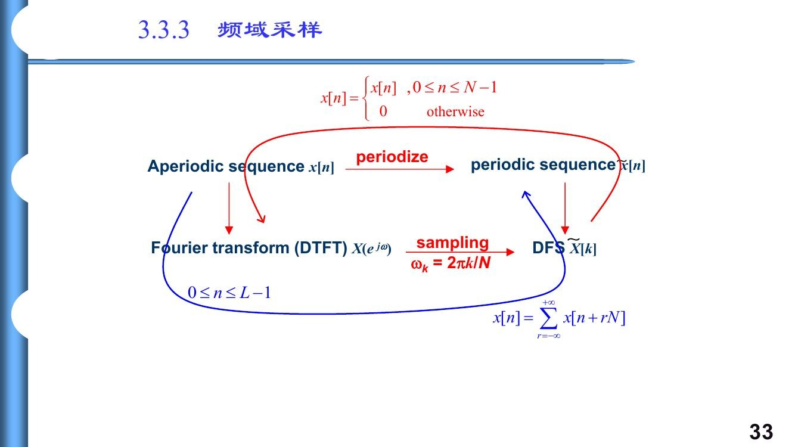
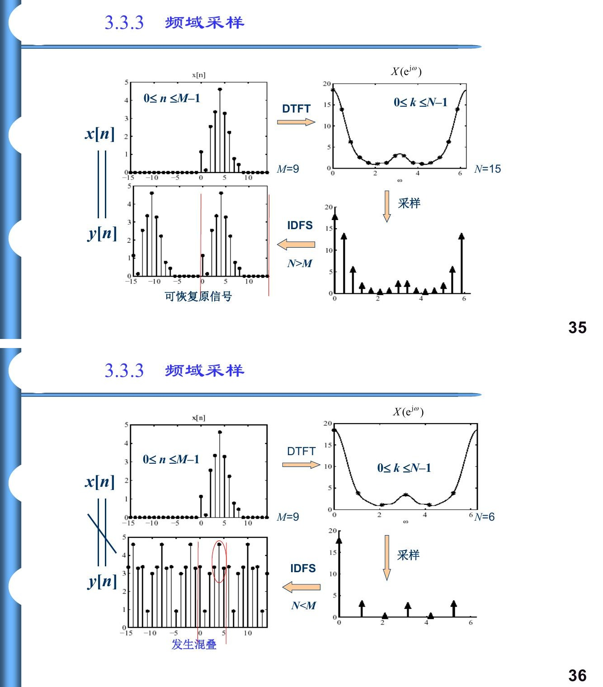
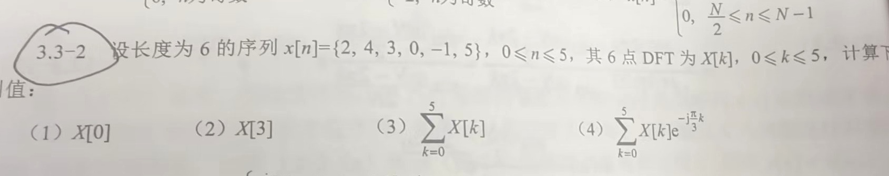

# 3.3节 有限长序列的 DFT

## 一、本节主线与资料编号说明

本节不是突然发明一种新的傅里叶变换，而是把前面学过的 DTFT 和 DFS 接到有限长、可计算的数据上：

$$
\boxed{
\text{有限长序列}
\xrightarrow{\text{DTFT}}
\text{连续频率函数}
\xrightarrow{\omega_k=2\pi k/N\text{ 采样}}
\text{DFT}
}
$$

同一件事也可以从 DFS 理解：

$$
\boxed{
\text{有限长主值序列}
\xrightarrow{N\text{ 周期延拓}}
\text{周期序列}
\xrightarrow{\text{DFS}}
\text{周期频域序列}
}
$$

DFT 就是取出两端的一个主值区间。因此本节的逻辑链是

$$
\boxed{
\text{有限长序列}
\longleftrightarrow
\text{主值序列}
\longleftrightarrow
\text{周期延拓}
\longleftrightarrow
\text{DFS}
\longleftrightarrow
\text{DTFT 等间隔采样}
\longleftrightarrow
\text{DFT}
}
$$

> 资料编号说明：课堂 PPT 将“有限长序列的 DFT”编为 3.3，主要见 PPT 导出 PDF 第 22—38 页；项目教材扫描本把同一内容编为 3.2，见教材印刷第 54—58 页（扫描 PDF 第 67—71 页）。后续线性、移位等性质在 PPT 中从 3.4 开始，在教材中从 3.3 开始。本文沿用课堂编号“3.3”，但知识内容按教材与 PPT 对应核对。

---

## 二、有限长序列、主值序列与周期延拓

### 1. 有限长序列

一个长度为 $N$ 的有限长序列通常写成

$$
x[n],\qquad 0\le n\le N-1,
$$

并约定区间外为零。也就是说，作为非周期有限长序列时，$x[-1]=x[N]=0$。

若实际非零长度为 $M$，而要求 $N$ 点 DFT，且 $N\ge M$，则先在尾部补零：

$$
x_N[n]=
\left\{
\begin{array}{ll}
x[n],&0\le n\le M-1,\\
0,&M\le n\le N-1.
\end{array}
\right.
$$

补零把数据组织成 $N$ 点序列，但不会增加原始观测信息。

### 2. 主值序列

设 $\widetilde{x}[n]$ 是周期为 $N$ 的周期序列。取它的一个完整周期 $0\le n\le N-1$，并令区间外为零，得到的有限长序列称为主值序列：

$$
x[n]=\widetilde{x}[n]R_N[n],
$$

其中

$$
R_N[n]=
\left\{
\begin{array}{ll}
1,&0\le n\le N-1,\\
0,&\text{其他}.
\end{array}
\right.
$$

课堂板书中的英文应为 **principal sequence**，不是 principle sequence。前者表示“主值序列”，后者表示“原则序列”，含义不同。

### 3. 周期延拓

把 $N$ 点有限长序列每隔 $N$ 点复制一次，得到周期序列

$$
\boxed{
\widetilde{x}[n]
=\sum_{r=-\infty}^{\infty}x[n-rN].
}
$$

也可用模 $N$ 记号写成

$$
\widetilde{x}[n]=x[\langle n\rangle_N],
$$

其中 $\langle n\rangle_N$ 表示 $n$ 除以 $N$ 后落在 $0,1,\ldots,N-1$ 内的余数。

必须区分：

- 有限长序列 $x[n]$ 在主值区间外为零；
- 周期延拓 $\widetilde{x}[n]$ 在主值区间外重复；
- DFT 的圆周移位、模 $N$ 下标和 IDFT 还原，都隐含使用了周期延拓。

---

## 三、DFS、DTFT 与 DFT 的联系

### 1. 三种变换研究的对象

| 变换 | 时域对象 | 频域结果 | 独立范围 |
|---|---|---|---|
| DTFT | 一般离散时间序列 $x[n]$ | 连续变量的 $X(e^{j\omega})$，对 $\omega$ 以 $2\pi$ 为周期 | 任意一个长度为 $2\pi$ 的频率区间 |
| DFS | $N$ 周期序列 $\widetilde{x}[n]$ | $N$ 周期系数序列 $\widetilde{X}[k]$ | $n,k=0,1,\ldots,N-1$ |
| DFT | $N$ 点有限长序列 $x[n]$ | $N$ 点有限长序列 $X[k]$ | $n,k=0,1,\ldots,N-1$ |

DFS 与 DFT 的求和公式相同，但研究对象不同。DFT 的输入是有限长序列；把它做 $N$ 周期延拓后，对应周期序列的 DFS 在一个主值周期内与 DFT 数值相同：

$$
\boxed{
X[k]=\widetilde{X}[k],\qquad 0\le k\le N-1.
}
$$

频域也可以作周期延拓：

$$
\widetilde{X}[k+N]=\widetilde{X}[k].
$$

DFT 只保存其中 $N$ 个独立样本。

> 图源：PPT 导出 PDF 第 33 页。红色路径表示时域周期延拓，蓝色路径表示频域采样后经 IDFS 得到周期延拓；两条路径由同一组 $N$ 个频域样本连接。

### 2. DFT 是 DTFT 的等间隔采样

对 $N$ 点有限长序列，DTFT 为

$$
X(e^{j\omega})
=\sum_{n=0}^{N-1}x[n]e^{-j\omega n}.
$$

在一个 $2\pi$ 周期内取 $N$ 个等间隔频率点

$$
\omega_k=\frac{2\pi}{N}k,
\qquad k=0,1,\ldots,N-1,
$$

则

$$
\boxed{
X[k]
=X(e^{j\omega})\bigg|_{\omega=2\pi k/N}
=\sum_{n=0}^{N-1}x[n]e^{-j2\pi kn/N}.
}
$$

因此，$N$ 点 DFT 的物理意义不是“把连续频谱变成另一条曲线”，而是：

> 在 DTFT 的一个 $2\pi$ 周期内，以 $\Delta\omega=2\pi/N$ 为间隔取 $N$ 个频率样本。

$k$ 只是频率采样点编号，真正的数字角频率是

$$
\boxed{\omega_k=\frac{2\pi}{N}k.}
$$

由于数字频率以 $2\pi$ 为周期，当 $k>N/2$ 时，也常把

$$
\omega_k=\frac{2\pi k}{N}
$$

改写到 $[-\pi,\pi)$ 内：

$$
\omega_k'=\frac{2\pi k}{N}-2\pi.
$$

例如 $N=8$ 时，$k=7$ 对应 $7\pi/4$，也就是 $-\pi/4$。

### 3. 补零的准确含义

若长度为 $M$ 的序列补零到 $N>M$ 点，则采样间隔由 $2\pi/M$ 变成 $2\pi/N$，会得到更密集的 DTFT 样本。但补零没有增加新的时域观测，也不能凭空提高区分两个相近真实频率的能力。

所以应说：

$$
\boxed{\text{补零使频谱采样更密，不等于增加原始信息。}}
$$

---

## 四、DFT 与 IDFT 的定义：范围和符号不能错

### 1. 旋转因子

定义

$$
\boxed{W_N=e^{-j2\pi/N}.}
$$

负号是旋转因子定义的一部分，不能漏掉。它满足

$$
W_N^N=1,
$$

以及

$$
W_N^{m+N}=W_N^m.
$$

### 2. $N$ 点 DFT

$$
\boxed{
X[k]
=\sum_{n=0}^{N-1}x[n]W_N^{kn},
\qquad 0\le k\le N-1.
}
$$

因为 $W_N^{kn}=e^{-j2\pi kn/N}$，DFT 正变换的复指数是负号。

### 3. $N$ 点 IDFT

$$
\boxed{
x[n]
=\frac1N\sum_{k=0}^{N-1}X[k]W_N^{-kn},
\qquad 0\le n\le N-1.
}
$$

因为 $W_N^{-kn}=e^{+j2\pi kn/N}$，IDFT 的复指数是正号，并且多出系数 $1/N$。

| 项目 | DFT | IDFT |
|---|---|---|
| 求和变量 | $n$ | $k$ |
| 输出索引 | $k$ | $n$ |
| 复指数符号 | $-$ | $+$ |
| 归一化系数 | 无 | $1/N$ |
| 主值范围 | $0\le k\le N-1$ | $0\le n\le N-1$ |

---

## 五、复指数正交性：DFT 为什么能把频率分开

### 1. 几何直觉

对固定的非零整数 $q$，序列

$$
e^{j2\pi qn/N},\qquad n=0,1,\ldots,N-1
$$

在单位圆上等角度转动。完整走过 $N$ 个样本后，这些复向量首尾均匀分布，矢量和为零。若 $q$ 是 $N$ 的整数倍，则每一项都等于 1，求和为 $N$。

### 2. 正交性公式

$$
\boxed{
\sum_{n=0}^{N-1}W_N^{(k-l)n}
=
\left\{
\begin{array}{ll}
N,&k\equiv l\pmod N,\\
0,&k\not\equiv l\pmod N.
\end{array}
\right.
}
$$

若只讨论主值区间 $k,l=0,1,\ldots,N-1$，条件 $k\equiv l\pmod N$ 就等价于 $k=l$。

### 3. 投影的物理意义

第 $k$ 个复指数基为

$$
\phi_k[n]=e^{j2\pi kn/N}.
$$

DFT 系数

$$
X[k]=\sum_{n=0}^{N-1}x[n]\phi_k^*[n]
$$

就是把 $x[n]$ 与第 $k$ 个频率模板作内积。由于不同模板彼此正交，其他频率在完整 $N$ 点求和中相消，只有匹配的频率成分留下。

因此可以把 DFT 记成一句话：

$$
\boxed{\text{DFT 是把 }N\text{ 点序列投影到 }N\text{ 个正交复指数基上。}}
$$

正交性也解释了为什么 IDFT 能无失真重构主值序列。

---

## 六、频域采样定理：为什么会出现时域周期延拓

设一般序列 $x[n]$ 的 DTFT 为 $X(e^{j\omega})$，在

$$
\omega_k=\frac{2\pi}{N}k
$$

处取样：

$$
Y[k]=X(e^{j\omega})\bigg|_{\omega=2\pi k/N}.
$$

对这 $N$ 个频域样本作 IDFT，利用复指数正交性可得

$$
\boxed{
y[n]=\sum_{r=-\infty}^{\infty}x[n+rN],
\qquad 0\le n\le N-1.
}
$$

这说明：

$$
\boxed{\text{频域等间隔采样}\quad\Longleftrightarrow\quad\text{时域周期延拓并叠加}.}
$$

若 $x[n]$ 只在 $0\le n\le M-1$ 非零，则分两种情况。

### 1. $N\ge M$：可以无混叠恢复

原序列能够完整放进长度为 $N$ 的主值区间，周期副本之间不重叠。IDFT 得到原序列的补零版本。

### 2. $N<M$：发生时域混叠

相隔 $N$ 的样本会折回同一位置并相加。例如

$$
x[n]=\{1,2,3,4\},\qquad N=2,
$$

则

$$
y[0]=x[0]+x[2]=4,
$$

$$
y[1]=x[1]+x[3]=6.
$$

所以只能得到 $\{4,6\}$，不能恢复原来的四个样本。

> 图源：PPT 导出 PDF 第 35—36 页。上图 $N=15>M=9$，周期副本不重叠；下图 $N=6<M=9$，相隔 $N$ 的样本叠加而发生时域混叠。

### 3. 对 $N\ge M$ 的准确理解

$N\ge M$ 不是“DFT 公式成立”的条件。只要给定一个 $N$ 点向量，就始终可以计算它的 $N$ 点 DFT。

$N\ge M$ 的真正含义是：

> 对原长度为 $M$ 的序列的 DTFT 取 $N$ 个等间隔样本后，若希望通过 $N$ 点 IDFT 无混叠地恢复原序列，需要 $N\ge M$。

不能把“截取原序列前 $N$ 点做 DFT”和“对完整原序列的 DTFT 取 $N$ 个样本”混为一谈。

---

## 七、求 DFT / DTFT 的四种方法

| 方法 | 核心操作 | 适用情况 | 易错点 |
|---|---|---|---|
| 定义法 | 直接代入求和 | 序列很短、结构不熟、用于保底 | 指数符号、求和范围、有限等比级数的特殊点 |
| 物理意义法 | 把 DFT 看成 DTFT 采样，或把有限序列看成周期序列的主值周期 | 已知 DTFT、明显是直流或单一频率、题目强调周期延拓 | 不要把连续 DTFT 曲线和 $N$ 个样本混为一谈 |
| 性质法 | 用线性、圆周移位、反褶、调制等性质 | 已知一个变换对，目标序列由其简单变形得到 | DFT 中是圆周移位，不是普通线性移位 |
| 基本变换对 | 识别冲激、常数、复指数、有限指数等 | 结构一眼可辨时最快 | 先确认点数 $N$ 与主值范围 |

实际做题建议按下面的顺序判断：

$$
\boxed{
\text{基本变换对}
\rightarrow
\text{性质}
\rightarrow
\text{DTFT 采样/物理意义}
\rightarrow
\text{定义法保底}
}
$$

### 1. 常用基本变换对

在 $0\le n,k\le N-1$ 内：

$$
\boxed{
\delta[n]
\xleftrightarrow{\mathrm{DFT}}
1
}
$$

$$
\boxed{
\delta[\langle n-n_0\rangle_N]
\xleftrightarrow{\mathrm{DFT}}
W_N^{kn_0}
}
$$

$$
\boxed{
1
\xleftrightarrow{\mathrm{DFT}}
N\delta[k]
}
$$

$$
\boxed{
e^{j2\pi mn/N}
\xleftrightarrow{\mathrm{DFT}}
N\delta[\langle k-m\rangle_N]
}
$$

其中 $\delta[k]$ 只在主值区间的 $k=0$ 处为 1；圆周移位后的冲激用模 $N$ 下标理解。

对有限指数序列

$$
x[n]=a^n,\qquad 0\le n\le N-1,
$$

定义法给出

$$
X[k]
=\sum_{n=0}^{N-1}(aW_N^k)^n
=\boxed{\frac{1-a^N}{1-aW_N^k}}.
$$

若分母为零，应回到原求和式取极限，此时对应结果为 $N$。

### 2. 线性性质

若

$$
x_1[n]\xleftrightarrow{\mathrm{DFT}}X_1[k],
\qquad
x_2[n]\xleftrightarrow{\mathrm{DFT}}X_2[k],
$$

且两者都按同一个 $N$ 点长度处理，则

$$
\boxed{
ax_1[n]+bx_2[n]
\xleftrightarrow{\mathrm{DFT}}
aX_1[k]+bX_2[k].
}
$$

若原序列长度不同，应先补零到同一个 $N\ge\max(N_1,N_2)$，再使用线性性质。

### 3. 圆周移位性质

若

$$
y[n]=x[\langle n-n_0\rangle_N],
$$

即把 $x[n]$ 圆周右移 $n_0$ 点，则

$$
\boxed{
Y[k]=W_N^{kn_0}X[k]
=e^{-j2\pi kn_0/N}X[k].
}
$$

相反，圆周左移 $n_0$ 点时

$$
x[\langle n+n_0\rangle_N]
\xleftrightarrow{\mathrm{DFT}}
W_N^{-kn_0}X[k].
$$

这里最稳的检查方法不是背“正负号”，而是先写

$$
W_N=e^{-j2\pi/N},
$$

再展开成普通复指数核对。

### 4. 频域圆周移位

时域乘复指数会使频域发生圆周移位：

$$
\boxed{
W_N^{-ln}x[n]
\xleftrightarrow{\mathrm{DFT}}
X[\langle k-l\rangle_N].
}
$$

因此“时域移位”对应“频域乘旋转因子”，“时域乘旋转因子”对应“频域移位”，两者不要混淆。

---

## 八、同一道题比较不同求法：四点常数序列

设

$$
x[n]=\{1,1,1,1\},\qquad 0\le n\le3.
$$

### 1. 定义法求 DTFT

$$
X(e^{j\omega})
=\sum_{n=0}^{3}e^{-j\omega n}
=1+e^{-j\omega}+e^{-j2\omega}+e^{-j3\omega}.
$$

利用有限等比级数可写成

$$
X(e^{j\omega})
=e^{-j3\omega/2}
\frac{\sin(2\omega)}{\sin(\omega/2)}.
$$

在分母为零的位置应取极限。

### 2. 由 DTFT 采样求四点 DFT

在

$$
\omega_k=0,\frac{\pi}{2},\pi,\frac{3\pi}{2}
$$

处采样：

$$
X[k]=X(e^{j\omega})\bigg|_{\omega=\pi k/2}.
$$

得到

$$
\boxed{X[k]=\{4,0,0,0\}.}
$$

### 3. 从物理意义直接判断

把 $\{1,1,1,1\}$ 作四周期延拓后，得到恒为 1 的直流序列。它只含 $k=0$ 的直流分量，所以除 $X[0]$ 外其余频点都为零，而

$$
X[0]=\sum_{n=0}^{3}x[n]=4.
$$

### 4. 正交性解释

当 $k=1$ 时，四个复向量为

$$
1,-j,-1,j,
$$

正好在单位圆上相互抵消。$k=2,3$ 时同样由正交性相消。这说明定义法、DTFT 采样法和物理意义法并不是三套互不相干的技巧，而是在描述同一个正交投影过程。

---

## 九、典型题：练习 3.3-2

> 图源：课堂对话中上传的教材练习页，练习 3.3-2。第（4）问指数为 $e^{-j\pi k/3}$。

已知

$$
x[n]=\{2,4,3,0,-1,5\},
\qquad 0\le n\le5,
$$

其六点 DFT 为 $X[k]$。

### 1. 求 $X[0]$

令 $k=0$，所有旋转因子都等于 1：

$$
X[0]=\sum_{n=0}^{5}x[n]
=2+4+3+0-1+5
=\boxed{13}.
$$

结论：

$$
\boxed{X[0]=\sum_{n=0}^{N-1}x[n]}
$$

表示直流频点等于时域样本之和。

### 2. 求 $X[3]$

因为 $N=6$ 且 $k=N/2=3$，

$$
e^{-j2\pi kn/N}=e^{-j\pi n}=(-1)^n.
$$

所以

$$
\begin{aligned}
X[3]
&=\sum_{n=0}^{5}x[n](-1)^n\\
&=2-4+3-0-1-5\\
&=\boxed{-5}.
\end{aligned}
$$

一般地，当 $N$ 为偶数时，

$$
\boxed{X[N/2]=\sum_{n=0}^{N-1}x[n](-1)^n.}
$$

### 3. 求 $\sum_{k=0}^{5}X[k]$

在 IDFT 中令 $n=0$：

$$
x[0]=\frac16\sum_{k=0}^{5}X[k].
$$

因此

$$
\boxed{
\sum_{k=0}^{5}X[k]=6x[0]=12.
}
$$

不要与 $X[0]=\sum_nx[n]$ 混淆：一个是时域求和得到频域第 0 点，另一个是频域求和得到 $Nx[0]$。

### 4. 求 $\sum_{k=0}^{5}X[k]e^{-j\pi k/3}$

六点 IDFT 为

$$
x[n]=\frac16\sum_{k=0}^{5}X[k]e^{j\pi kn/3}.
$$

题目中的指数满足

$$
e^{-j\pi k/3}=e^{j\pi k(-1)/3},
$$

因此它对应 $n=-1$：

$$
\sum_{k=0}^{5}X[k]e^{-j\pi k/3}
=6\widetilde{x}[-1].
$$

利用六周期延拓，

$$
-1\equiv5\pmod6,
$$

所以

$$
\widetilde{x}[-1]=x[5]=5.
$$

最终

$$
\boxed{
\sum_{k=0}^{5}X[k]e^{-j\pi k/3}=30.
}
$$

这里严格地说应写 $\widetilde{x}[-1]=x[5]$，因为有限长序列本身在区间外为零；负下标的等价关系来自 DFT 隐含的周期延拓。

> 课堂纠错：这道题第（4）问一度被误读为 $e^{-j2\pi k/3}$，从而错误对应到 $n=-2$。教材题面实际是 $e^{-j\pi k/3}$，应对应 $n=-1$，正确答案为 $30$。

本题四问最终结果为

$$
\boxed{13,\quad -5,\quad 12,\quad 30.}
$$

---

## 十、典型题：练习 3.3-3 的复指数序列

设

$$
x[n]=
\left\{
\begin{array}{ll}
e^{j\omega_0n},&0\le n\le N-1,\\
0,&\text{其他}.
\end{array}
\right.
$$

### 1. 用定义求 DTFT

$$
\begin{aligned}
X(e^{j\omega})
&=\sum_{n=0}^{N-1}e^{j\omega_0n}e^{-j\omega n}\\
&=\sum_{n=0}^{N-1}e^{-j(\omega-\omega_0)n}.
\end{aligned}
$$

这是有限等比级数：

$$
\boxed{
X(e^{j\omega})
=\frac{1-e^{-jN(\omega-\omega_0)}}
{1-e^{-j(\omega-\omega_0)}}.
}
$$

也可写成

$$
X(e^{j\omega})
=e^{-j(N-1)(\omega-\omega_0)/2}
\frac{\sin\left[N(\omega-\omega_0)/2\right]}
{\sin\left[(\omega-\omega_0)/2\right]}.
$$

当分母为零时应取极限，结果为 $N$。

### 2. 由 DTFT 采样求 $N$ 点 DFT

$$
\boxed{
X[k]
=X(e^{j\omega})\bigg|_{\omega=2\pi k/N}
=\sum_{n=0}^{N-1}e^{-j(2\pi k/N-\omega_0)n}.
}
$$

若

$$
\omega_0=\frac{2\pi}{N}k_0,
$$

则信号频率恰好落在第 $k_0$ 个 DFT 频点上。利用正交性，

$$
\boxed{
X[k]=N\delta[\langle k-k_0\rangle_N].
}
$$

也就是说，能量只落在一个频率格点。若 $k_0\ge N$，只需取 $k_0$ 对 $N$ 的余数；这反映了离散频率与 DFT 索引的周期性，而不是出现了一个新的更高频率。

若 $\omega_0$ 不等于任何 $2\pi k/N$，频率不落在 DFT 格点上，多个 $X[k]$ 一般都不为零。这是后续理解频谱泄漏的重要入口。

---

## 十一、易错点与课堂记录纠正

1. **principal sequence，不是 principle sequence。** 主值序列是从周期序列截取一个完整周期并令区间外为零。
2. **教材与 PPT 的章节编号不同。** PPT 把有限长序列 DFT 编为 3.3；项目教材扫描本编为 3.2。复习时按知识点对应，不要只看编号。
3. **$n$ 和 $k$ 都只取 $0,1,\ldots,N-1$。** $n$ 是时域样本索引，$k$ 是频域格点索引，$\omega_k=2\pi k/N$ 才是数字角频率。
4. **$W_N$ 自带负号。** $W_N=e^{-j2\pi/N}$；DFT 用 $W_N^{kn}$，IDFT 用 $W_N^{-kn}/N$。
5. **DFT 是 DTFT 的样本，不是完整 DTFT。** $N$ 个 DFT 值不能直接等同于整条连续频谱曲线。
6. **$N\ge M$ 不是 DFT 定义的限制。** 它是由 DTFT 的 $N$ 个样本无混叠恢复一般 $M$ 点有限长序列的条件。
7. **补零只增加频域采样密度。** 它不会增加原信号的信息量，也不能凭空创造真实频率分辨能力。
8. **普通移位与圆周移位不同。** DFT 移位性质中的 $x[\langle n-n_0\rangle_N]$ 必须按模 $N$ 回绕。
9. **负下标来自周期延拓。** 写 $x[-1]=x[N-1]$ 时，严格对象应是周期延拓 $\widetilde{x}[n]$，不是区间外为零的有限长序列。
10. **练习 3.3-2 第（4）问指数是 $e^{-j\pi k/3}$。** 正确结果为 $30$；指数正负号决定在 IDFT 中对应哪个时域下标。
11. **有限等比级数出现 $0/0$ 时不能直接判零。** 应回到原求和式或取极限，匹配频率处通常得到 $N$。
12. **实序列的后半段频点可解释为负频率。** 例如 $k=N-1$ 对应 $-2\pi/N$，不要误认为是超过 $\pi$ 的全新高频。

---

## 十二、做题流程与应达到的掌握程度

拿到一道 DFT / DTFT 题时，按下面的顺序检查：

1. 明确有限长序列的非零范围、长度 $M$ 和所求 DFT 点数 $N$；
2. 写清 $0\le n,k\le N-1$，若 $N>M$ 先补零；
3. 观察是否属于冲激、常数、复指数、有限指数等基本变换对；
4. 检查是否由已知序列经过线性组合、圆周移位、反褶或调制得到；
5. 若已知 DTFT，直接在 $\omega=2\pi k/N$ 处采样；
6. 若看到 $\sum_kX[k]e^{j2\pi km/N}$，优先识别为 $Nx[m]$，再按模 $N$ 处理下标；
7. 都不适用时回到定义，并优先识别有限等比级数；
8. 用 $X[0]=\sum_nx[n]$、$\sum_kX[k]=Nx[0]$、实序列共轭对称等结论检查答案。

完成本节后，应能独立解释并使用下面这张核心关系：

$$
\boxed{
\begin{array}{ccc}
\text{有限长序列 }x[n]
&\xrightarrow{N\text{ 周期延拓}}&
\text{周期序列 }\widetilde{x}[n]\\
\downarrow\mathrm{DTFT}&&\downarrow\mathrm{DFS}\\
X(e^{j\omega})
&\xrightarrow{\omega_k=2\pi k/N\text{ 采样}}&
\widetilde{X}[k]
\end{array}
}
$$

在主值区间内，右下角就是有限长序列的 DFT：

$$
\boxed{
X[k]
=\widetilde{X}[k]
=X(e^{j\omega})\bigg|_{\omega=2\pi k/N},
\qquad 0\le k\le N-1.
}
$$

这条关系把有限长序列、主值序列、周期延拓、DFS、DTFT 采样、DFT、复指数正交性和圆周运算连成了一套统一的逻辑。
