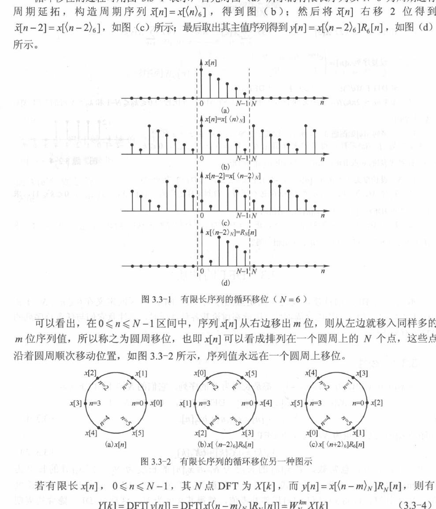
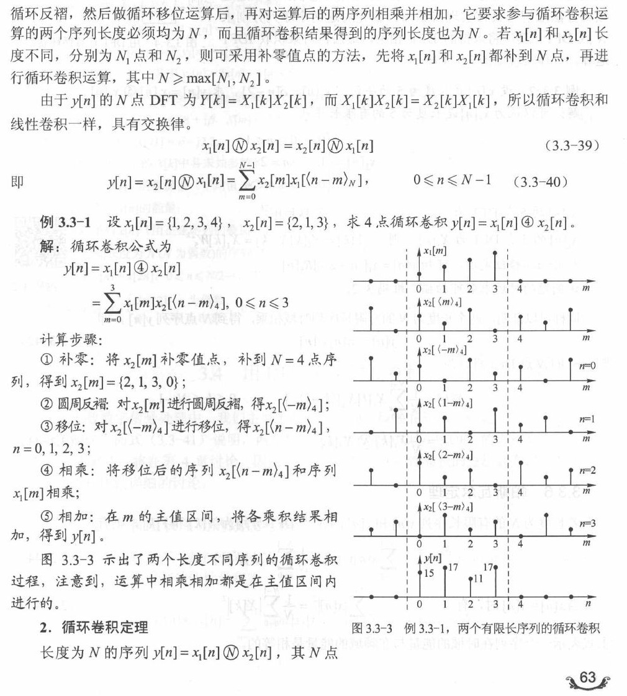
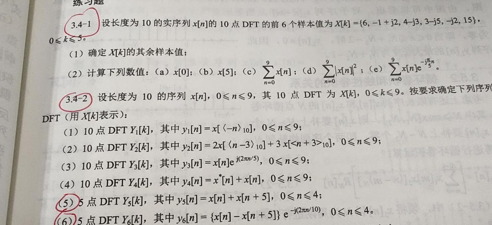

# 3.4节 DFT 的性质

## 一、本节主线与资料编号说明

3.3 解决的是“DFT 是什么”，3.4 解决的是“怎样利用结构少算、快算并检查答案”。本节按课堂 PPT 的顺序整理：

$$
\boxed{
\text{线性}
\rightarrow
\text{圆周移位}
\rightarrow
\text{对偶性}
\rightarrow
\text{圆周共轭对称性}
\rightarrow
\text{循环卷积}
\rightarrow
\text{帕斯瓦尔定理}
}
$$

其中最常用的三条结论是：

$$
\boxed{
x[\langle n-m\rangle_N]
\xleftrightarrow{\mathrm{DFT}}
W_N^{km}X[k]
}
$$

$$
\boxed{
x[n]\text{ 为实序列}
\quad\Longrightarrow\quad
X[N-k]=X^*[k]
}
$$

$$
\boxed{
x_1[n]\circledast_Nx_2[n]
\xleftrightarrow{\mathrm{DFT}}
X_1[k]X_2[k]
}
$$

> 资料编号说明：课堂 PPT 把这组性质编为 3.4；项目教材扫描本把同一内容编为 3.3，见教材印刷第 59—64 页（扫描 PDF 第 72—77 页）。本文沿用课堂编号“3.4”，引用教材图片时同时标明教材页码。

本节所有 DFT 默认采用

$$
W_N=e^{-j2\pi/N},
$$

$$
X[k]=\sum_{n=0}^{N-1}x[n]W_N^{kn},
\qquad 0\le k\le N-1.
$$

凡是出现 $n-m$、$-n$、$N-k$，都要按模 $N$ 理解并统一到主值范围。

---

## 二、线性：先统一 DFT 点数

若

$$
x_1[n]\xleftrightarrow{N\text{ 点 DFT}}X_1[k],
\qquad
x_2[n]\xleftrightarrow{N\text{ 点 DFT}}X_2[k],
$$

则

$$
\boxed{
ax_1[n]+bx_2[n]
\xleftrightarrow{N\text{ 点 DFT}}
aX_1[k]+bX_2[k].
}
$$

若两个有限长序列的实际长度分别为 $N_1,N_2$，使用线性性质前应先选定同一个 DFT 点数

$$
N\ge\max(N_1,N_2),
$$

并把较短的序列补零到 $N$ 点。

易错点：线性性质要求两边使用同一个 $N$。不能把一个 5 点 DFT 和一个 10 点 DFT 直接逐点相加。

---

## 三、圆周移位：为什么一定会“绕回来”

### 1. 圆周移位的定义

设 $x[n]$ 是 $N$ 点有限长序列。圆周右移 $m$ 点定义为

$$
\boxed{
y[n]=x[\langle n-m\rangle_N],
\qquad 0\le n\le N-1.
}
$$

操作过程是：先把 $x[n]$ 作 $N$ 周期延拓，再普通右移 $m$ 点，最后截取主值区间 $0\le n\le N-1$。移出右端的样本会从左端重新进入，所以结果仍然只有 $N$ 点。

> 图源：项目教材印刷第 60 页（扫描 PDF 第 73 页），图 3.3-1、图 3.3-2。教材按 3.3 编号，课堂 PPT 对应 3.4。

### 2. 时域圆周移位定理

若

$$
x[n]\xleftrightarrow{\mathrm{DFT}}X[k],
$$

则圆周右移 $m$ 点有

$$
\boxed{
x[\langle n-m\rangle_N]
\xleftrightarrow{\mathrm{DFT}}
W_N^{km}X[k].
}
$$

由于

$$
W_N^{km}=e^{-j2\pi km/N},
$$

右移对应负相位。圆周左移 $m$ 点则为

$$
\boxed{
x[\langle n+m\rangle_N]
\xleftrightarrow{\mathrm{DFT}}
W_N^{-km}X[k].
}
$$

不要孤立地背正负号。先把 $W_N$ 展开成 $e^{-j2\pi/N}$，再检查相位最稳。

### 3. 频域圆周移位

时域乘复指数会使频域圆周移位：

$$
\boxed{
x[n]W_N^{-ln}
\xleftrightarrow{\mathrm{DFT}}
X[\langle k-l\rangle_N].
}
$$

相应地，

$$
x[n]W_N^{ln}
\xleftrightarrow{\mathrm{DFT}}
X[\langle k+l\rangle_N].
$$

因此：

- 时域圆周移位，对应频域乘旋转因子；
- 时域乘旋转因子，对应频域圆周移位。

---

## 四、对偶性：交换时域与频域时要反褶并乘 $N$

若

$$
x[n]\xleftrightarrow{\mathrm{DFT}}X[k],
$$

则把 $X[k]$ 当作一个 $N$ 点时域序列再作 DFT，可得

$$
\boxed{
X[n]
\xleftrightarrow{\mathrm{DFT}}
N x[\langle-k\rangle_N].
}
$$

这就是 DFT 的对偶性。它不是简单地把 $x$ 和 $X$ 交换，而是还要：

1. 将原序列作圆周反褶 $n\mapsto\langle-n\rangle_N$；
2. 乘上系数 $N$。

连续做两次 DFT：

$$
\boxed{
\mathrm{DFT}\{\mathrm{DFT}\{x[n]\}\}
=N x[\langle-n\rangle_N].
}
$$

连续做四次 DFT：

$$
\boxed{
\mathrm{DFT}^4\{x[n]\}=N^2x[n].
}
$$

对偶性常用于从一个已知变换对快速得到另一个变换对，也可以作为答案检查手段。

---

## 五、圆周共轭对称性：CCS / CCA 到底有什么用

### 1. 先看两个基础共轭性质

若

$$
x[n]\xleftrightarrow{\mathrm{DFT}}X[k],
$$

则

$$
\boxed{
x^*[n]
\xleftrightarrow{\mathrm{DFT}}
X^*[\langle-k\rangle_N]
}
$$

以及

$$
\boxed{
x^*[\langle-n\rangle_N]
\xleftrightarrow{\mathrm{DFT}}
X^*[k].
}
$$

### 2. CCS 与 CCA 的定义

任意 $N$ 点复序列都可以分解为圆周共轭对称部分和圆周共轭反对称部分：

$$
\boxed{
x[n]=x_{\mathrm{ccs}}[n]+x_{\mathrm{cca}}[n].
}
$$

其中

$$
x_{\mathrm{ccs}}[n]
=\frac12\left(x[n]+x^*[\langle-n\rangle_N]\right),
$$

$$
x_{\mathrm{cca}}[n]
=\frac12\left(x[n]-x^*[\langle-n\rangle_N]\right).
$$

它们分别满足

$$
x_{\mathrm{ccs}}[n]
=x_{\mathrm{ccs}}^*[\langle-n\rangle_N],
$$

$$
x_{\mathrm{cca}}[n]
=-x_{\mathrm{cca}}^*[\langle-n\rangle_N].
$$

### 3. CCS / CCA 和频谱实部、虚部的对应关系

利用前面的共轭性质：

$$
\boxed{
x_{\mathrm{ccs}}[n]
\xleftrightarrow{\mathrm{DFT}}
\mathrm{Re}\{X[k]\}
}
$$

$$
\boxed{
x_{\mathrm{cca}}[n]
\xleftrightarrow{\mathrm{DFT}}
j\,\mathrm{Im}\{X[k]\}.
}
$$

所以 CCS / CCA 的用途不是要求每道题都先分解一次，而是建立下面的结构联系：

$$
\boxed{
\text{时域的圆周共轭对称结构}
\longleftrightarrow
\text{频域的实部}
}
$$

$$
\boxed{
\text{时域的圆周共轭反对称结构}
\longleftrightarrow
\text{频域的虚部}
}
$$

当题目要求判断频谱是否为实数、纯虚数，或者只给部分频点要求补全时，这组关系才最有用。

### 4. 最常用结论：实序列的 DFT

若

$$
x[n]\in\mathbb R,
$$

则

$$
\boxed{
X[\langle-k\rangle_N]=X^*[k].
}
$$

在主值区间中，通常写成

$$
\boxed{
X[N-k]=X^*[k],
\qquad 1\le k\le N-1.
}
$$

由此立即得到：

$$
\mathrm{Re}\{X[N-k]\}=\mathrm{Re}\{X[k]\},
$$

$$
\mathrm{Im}\{X[N-k]\}=-\mathrm{Im}\{X[k]\},
$$

$$
|X[N-k]|=|X[k]|.
$$

也就是说，实部和幅度具有圆周偶对称，虚部具有圆周奇对称。

另外：

- $X[0]$ 一定是实数；
- 若 $N$ 为偶数，$X[N/2]$ 也一定是实数；
- 已知约一半频点即可补出另一半，实际计算量可以减少近一半。

这就是课堂里“实部、虚部、CCS、CCA”最终服务的最实用结论。

---

## 六、循环卷积：频域相乘的真正时域含义

### 1. 定义

把两个序列都按同一个 $N$ 点长度处理，则其 $N$ 点循环卷积定义为

$$
\boxed{
y[n]
=x_1[n]\circledast_Nx_2[n]
=\sum_{m=0}^{N-1}
x_1[m]x_2[\langle n-m\rangle_N],
\quad 0\le n\le N-1.
}
$$

图解计算可按下面的顺序：

$$
\boxed{
\text{补零到 }N\text{ 点}
\rightarrow
\text{圆周反褶}
\rightarrow
\text{圆周移位}
\rightarrow
\text{逐点相乘}
\rightarrow
\text{求和}
}
$$

> 图源：项目教材印刷第 63 页（扫描 PDF 第 76 页），例 3.3-1 与图 3.3-3。图中两序列长度不同，先补零到共同长度 $N=4$。

### 2. 循环卷积定理

若

$$
x_1[n]\xleftrightarrow{\mathrm{DFT}}X_1[k],
\qquad
x_2[n]\xleftrightarrow{\mathrm{DFT}}X_2[k],
$$

则

$$
\boxed{
x_1[n]\circledast_Nx_2[n]
\xleftrightarrow{\mathrm{DFT}}
X_1[k]X_2[k].
}
$$

因此看到

$$
Y[k]=X_1[k]X_2[k]
$$

时，作 $N$ 点 IDFT 得到的本来是 $N$ 点循环卷积，不是自动得到线性卷积。3.5 将专门说明怎样通过补零使两者相等。

相反，时域逐点相乘对应频域循环卷积并带系数 $1/N$：

$$
\boxed{
x_1[n]x_2[n]
\xleftrightarrow{\mathrm{DFT}}
\frac1N\left(X_1[k]\circledast_NX_2[k]\right).
}
$$

---

## 七、帕斯瓦尔定理：时域能量等于频域能量

对两个 $N$ 点序列，帕斯瓦尔关系为

$$
\boxed{
\sum_{n=0}^{N-1}x[n]y^*[n]
=\frac1N\sum_{k=0}^{N-1}X[k]Y^*[k].
}
$$

令 $y[n]=x[n]$，得到能量形式：

$$
\boxed{
\sum_{n=0}^{N-1}|x[n]|^2
=\frac1N\sum_{k=0}^{N-1}|X[k]|^2.
}
$$

系数 $1/N$ 来自本课程采用“DFT 不归一化、IDFT 除以 $N$”的定义。若其他教材把归一化系数分配到正变换，公式形式会相应改变。

帕斯瓦尔定理常用于：

- 不作 IDFT，直接由 $X[k]$ 计算时域总能量；
- 检查 DFT 数值是否明显出错；
- 把内积、相关和能量问题转到更容易计算的一侧。

---

## 八、典型题：课堂练习 3.4-1

> 图源：课堂对话中上传的教材练习页。该练习册把 DFT 性质编为 3.4；项目教材同类内容编为 3.3。

已知长度为 10 的实序列 $x[n]$ 的 10 点 DFT 前 6 个样本为

$$
\begin{aligned}
X[0]&=6,\\
X[1]&=-1+j2,\\
X[2]&=4-j3,\\
X[3]&=3-j5,\\
X[4]&=-j2,\\
X[5]&=15.
\end{aligned}
$$

### 1. 补全其余频点

因为 $x[n]$ 为实序列，

$$
X[10-k]=X^*[k].
$$

所以

$$
\boxed{
\begin{aligned}
X[6]&=X^*[4]=j2,\\
X[7]&=X^*[3]=3+j5,\\
X[8]&=X^*[2]=4+j3,\\
X[9]&=X^*[1]=-1-j2.
\end{aligned}
}
$$

$X[0]$ 和 $X[5]$ 分别是直流频点和偶数长度下的奈奎斯特频点，本来就应为实数，题目数据与该条件一致。

### 2. 求 $x[0]$

由 IDFT 在 $n=0$ 处的公式：

$$
x[0]=\frac1{10}\sum_{k=0}^{9}X[k].
$$

共轭频点成对相加后虚部抵消：

$$
\sum_{k=0}^{9}X[k]=33.
$$

因此

$$
\boxed{x[0]=\frac{33}{10}=3.3.}
$$

### 3. 求 $x[5]$

因为

$$
W_{10}^{-5k}=e^{j\pi k}=(-1)^k,
$$

所以

$$
x[5]
=\frac1{10}\sum_{k=0}^{9}X[k](-1)^k
=\frac{-5}{10}.
$$

故

$$
\boxed{x[5]=-\frac12.}
$$

### 4. 求 $\sum_{n=0}^{9}x[n]$

由直流频点性质：

$$
\boxed{
\sum_{n=0}^{9}x[n]=X[0]=6.
}
$$

### 5. 求 $\sum_{n=0}^{9}|x[n]|^2$

由帕斯瓦尔定理：

$$
\sum_{n=0}^{9}|x[n]|^2
=\frac1{10}\sum_{k=0}^{9}|X[k]|^2.
$$

利用共轭对称，成对频点的模平方相同：

$$
\begin{aligned}
\sum_{k=0}^{9}|X[k]|^2
&=6^2+15^2\\
&\quad+2\left(5+25+34+4\right)\\
&=397.
\end{aligned}
$$

所以

$$
\boxed{
\sum_{n=0}^{9}|x[n]|^2
=\frac{397}{10}=39.7.
}
$$

### 6. 求 $\sum_{n=0}^{9}x[n]e^{-j\pi n/5}$

10 点 DFT 的核为

$$
e^{-j2\pi kn/10}.
$$

题目中的指数

$$
e^{-j\pi n/5}=e^{-j2\pi n/10}
$$

正好对应 $k=1$，因此

$$
\boxed{
\sum_{n=0}^{9}x[n]e^{-j\pi n/5}
=X[1]
=-1+j2.
}
$$

本题把实序列共轭对称、IDFT 特殊点、直流频点、帕斯瓦尔定理和“看指数认频点”串在了一起。

---

## 九、典型题：课堂练习 3.4-2（5）（6）

设长度为 10 的序列 $x[n]$ 的 10 点 DFT 为 $X[k]$。

### 1. 第（5）问：五点和序列对应偶数频点

题目给出

$$
y_5[n]=x[n]+x[n+5],
\qquad 0\le n\le4,
$$

求其 5 点 DFT $Y_5[r]$。

从输出序列直接按定义展开：

$$
\begin{aligned}
Y_5[r]
&=\sum_{n=0}^{4}[x[n]+x[n+5]]W_5^{rn}\\
&=\sum_{n=0}^{4}[x[n]+x[n+5]]W_{10}^{2rn},
\end{aligned}
$$

其中使用了

$$
W_5=W_{10}^2.
$$

指数 $2r$ 提示它应对应 10 点 DFT 的偶数频点。验证：

$$
\begin{aligned}
X[2r]
&=\sum_{n=0}^{4}x[n]W_{10}^{2rn}
+\sum_{n=0}^{4}x[n+5]W_{10}^{2r(n+5)}\\
&=\sum_{n=0}^{4}[x[n]+x[n+5]]W_{10}^{2rn},
\end{aligned}
$$

因为

$$
W_{10}^{10r}=1.
$$

所以

$$
\boxed{
Y_5[r]=X[2r],
\qquad 0\le r\le4.
}
$$

把输出索引重新写成题目常用的 $k$：

$$
\boxed{
Y_5[k]=X[2k],
\qquad 0\le k\le4.
}
$$

对应关系为

$$
Y_5[0],Y_5[1],Y_5[2],Y_5[3],Y_5[4]
=X[0],X[2],X[4],X[6],X[8].
$$

### 2. 第（6）问：五点差序列经调制后对应奇数频点

题目给出

$$
y_6[n]
=[x[n]-x[n+5]]e^{-j2\pi n/10},
\qquad 0\le n\le4.
$$

先写成

$$
y_6[n]=[x[n]-x[n+5]]W_{10}^n.
$$

求 5 点 DFT：

$$
\begin{aligned}
Y_6[r]
&=\sum_{n=0}^{4}[x[n]-x[n+5]]W_{10}^nW_5^{rn}\\
&=\sum_{n=0}^{4}[x[n]-x[n+5]]W_{10}^{(2r+1)n}.
\end{aligned}
$$

此时不需要预先知道“应取奇数频点”。指数中的

$$
\boxed{2r+1}
$$

会自然提示去比较 $X[2r+1]$。

把 10 点 DFT 按前后 5 点拆开：

$$
\begin{aligned}
X[2r+1]
&=\sum_{n=0}^{4}x[n]W_{10}^{(2r+1)n}\\
&\quad+\sum_{n=0}^{4}x[n+5]W_{10}^{(2r+1)(n+5)}.
\end{aligned}
$$

而

$$
W_{10}^{5(2r+1)}
=(-1)^{2r+1}
=-1,
$$

所以

$$
X[2r+1]
=\sum_{n=0}^{4}[x[n]-x[n+5]]W_{10}^{(2r+1)n}.
$$

这与 $Y_6[r]$ 完全相同。因此

$$
\boxed{
Y_6[r]=X[2r+1],
\qquad 0\le r\le4.
}
$$

统一改回 $k$：

$$
\boxed{
Y_6[k]=X[2k+1],
\qquad 0\le k\le4.
}
$$

对应关系为

$$
Y_6[0],Y_6[1],Y_6[2],Y_6[3],Y_6[4]
=X[1],X[3],X[5],X[7],X[9].
$$

### 3. 一条母公式同时看出奇、偶频点

把一般的 10 点频谱按前后 5 点拆开：

$$
\boxed{
X[q]
=\sum_{n=0}^{4}
\left[x[n]+(-1)^q x[n+5]\right]W_{10}^{qn}.
}
$$

- $q=2r$ 时，$(-1)^q=1$，得到和序列，取偶数频点；
- $q=2r+1$ 时，$(-1)^q=-1$，得到差序列，取奇数频点；
- 第（6）问再乘 $W_{10}^n$，是为了把 5 点 DFT 原本生成的 $2r$ 推成 $2r+1$。

这两问最重要的方法不是死记答案，而是：

$$
\boxed{
\text{先按定义展开}
\rightarrow
\text{统一旋转因子}
\rightarrow
\text{从指数识别频点}
\rightarrow
\text{拆开原 DFT 验证}
}
$$

---

## 十、易错点与方法总结

1. **所有性质必须在同一个 $N$ 点体系内使用。** 序列长度不同先补零到共同点数。
2. **普通移位不等于圆周移位。** DFT 性质中的下标必须写成 $\langle n-m\rangle_N$。
3. **右移和左移的相位符号不要只靠背。** 展开 $W_N=e^{-j2\pi/N}$ 检查。
4. **对偶性会反褶并乘 $N$。** 不能只交换 $x[n]$ 与 $X[k]$。
5. **CCS / CCA 是解释结构的桥梁，不是每题必算步骤。** 最常用落点是实序列的 $X[N-k]=X^*[k]$。
6. **$X[0]$ 与 $X[N/2]$ 的特殊性有条件。** $X[N/2]$ 只有在 $N$ 为偶数时才存在；对实序列它们都为实数。
7. **频域相乘经 IDFT 得到的是循环卷积。** 是否等于线性卷积，要到 3.5 检查补零长度。
8. **帕斯瓦尔公式中的 $1/N$ 不能漏。** 它由本课程的 DFT/IDFT 归一化约定决定。
9. **先给同余条件，再找主值范围内的具体下标。** 最后把所有 $k$ 统一到 $0\le k\le N-1$。
10. **看到混合的 $W_5$ 与 $W_{10}$ 先统一底数。** $W_5=W_{10}^2$ 是 3.4-2（5）（6）的关键。

本节可压缩成一张做题路线：

$$
\boxed{
\begin{array}{c}
\text{先确认 }N\text{ 与主值范围}\\
\downarrow\\
\text{识别线性、圆周移位、共轭、对偶或卷积结构}\\
\downarrow\\
\text{统一旋转因子与模 }N\text{ 下标}\\
\downarrow\\
\text{利用实序列对称性、帕斯瓦尔或特殊频点检查}
\end{array}
}
$$
