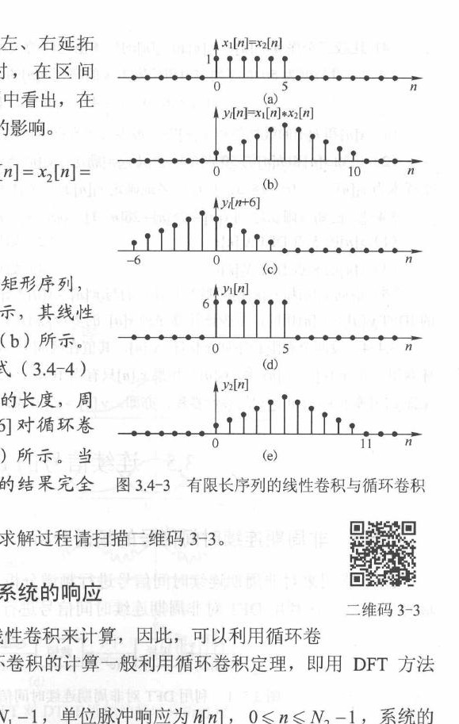
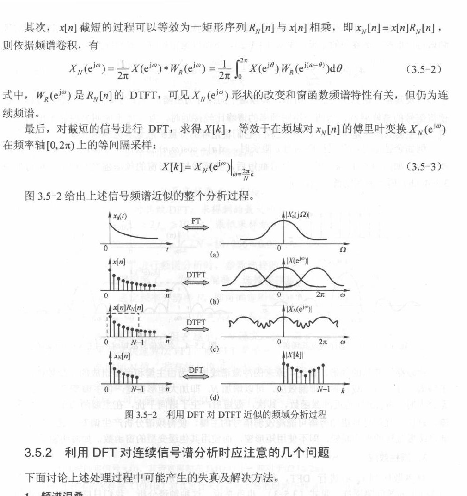

# 3.5节 用 DFT 实现线性卷积

## 一、本节主线与资料编号说明

3.4 已经得到循环卷积定理：

$$
x[n]\circledast_N h[n]
\xleftrightarrow{\mathrm{DFT}}
X[k]H[k].
$$

因此，两个 $N$ 点 DFT 相乘后再作 $N$ 点 IDFT，**直接得到的一定是 $N$ 点圆周卷积**，并不会自动变成线性卷积。3.5 的核心，就是通过足够长的补零，让圆周卷积的“首尾相接”不发生混叠，从而使它与线性卷积相同。

本节主线可概括为

$$
\boxed{
\text{线性卷积}
\xrightarrow{\text{补零到足够长}}
\text{同长度的圆周卷积}
\xrightarrow{\mathrm{DFT/IDFT}}
\text{频域乘法实现}
}
$$

> 资料编号说明：课堂 PPT 把“用 DFT 实现线性卷积”编为 3.5；项目教材扫描本把相同内容编为 3.4，见教材印刷第 65—67 页（扫描 PDF 第 78—80 页）。教材印刷第 68 页起的 3.5 讨论“用 DFT 对连续时间信号作频谱分析”。本文沿用课堂编号，以线性卷积为主线，并在后半部分补充与本章紧密相连的频率采样间隔和频率分辨率。

---

## 二、先分清：线性卷积与 $N$ 点圆周卷积

设有限长序列 $x[n]$、$h[n]$ 的长度分别为 $L$、$M$，并假设它们的首个非零样本从 $n=0$ 开始。

### 1. 线性卷积

$$
y_l[n]=x[n]*h[n]
=\sum_{m=-\infty}^{\infty}x[m]h[n-m].
$$

输出长度为

$$
\boxed{L_y=L+M-1}.
$$

### 2. $N$ 点圆周卷积

将两序列都看成 $N$ 点序列后，

$$
y_c[n]
=x[n]\circledast_N h[n]
=\sum_{m=0}^{N-1}x[m]h[\langle n-m\rangle_N],
\qquad 0\le n\le N-1.
$$

下标中的 $\langle\cdot\rangle_N$ 表示对 $N$ 取余，因此圆周卷积的输出只有 $N$ 点。

### 3. 两者的本质关系：时域混叠

在共同的 $N$ 点体系下，圆周卷积可以看成线性卷积每隔 $N$ 点折回相加：

$$
\boxed{
y_c[n]
=\sum_{r=-\infty}^{\infty}y_l[n+rN],
\qquad 0\le n\le N-1.
}
$$

对从 $n=0$ 开始的有限长序列，上式通常只需写成

$$
y_c[n]=y_l[n]+y_l[n+N]+y_l[n+2N]+\cdots.
$$

只要右侧除第一项外还有非零项，后面的样本就会折回前面，这就是**时域混叠**。

---

## 三、什么时候圆周卷积等于线性卷积

> 图片来源：项目教材印刷第 67 页（扫描 PDF 第 80 页）。图中把线性卷积结果按不同点数作周期延拓，用来比较补零长度不足和足够时的圆周卷积。

线性卷积共有 $L+M-1$ 个可能非零的样本。若选择

$$
\boxed{N\ge L+M-1}
$$

并把 $x[n]$、$h[n]$ 都补零到 $N$ 点，那么线性卷积的非零部分能完整放在一个 $N$ 点主值区间内，不会发生折叠，因此

$$
\boxed{
x_N[n]\circledast_N h_N[n]
=x[n]*h[n],
\qquad 0\le n\le L+M-2.
}
$$

这里 $x_N[n]$、$h_N[n]$ 表示补零后的 $N$ 点序列。

- 当 $N=L+M-1$ 时，IDFT 的全部 $N$ 点恰好就是线性卷积结果；
- 当 $N>L+M-1$ 时，前 $L+M-1$ 点是线性卷积结果，后面是补出的零；
- 当 $N<L+M-1$ 时，得到的是折叠后的圆周卷积，不能直接当作线性卷积。

> 若序列的首个非零样本不是从 $n=0$ 开始，长度条件仍然不变；只需另外注意线性卷积输出的起始下标等于两个输入起始下标之和。

---

## 四、用 DFT 实现线性卷积的标准流程

设 $x[n]$ 长度为 $L$，$h[n]$ 长度为 $M$。

### 第一步：确定 DFT 点数

$$
N\ge L+M-1.
$$

理论上可取最小值 $N=L+M-1$；实际使用 FFT 时，也常取不小于该值且计算方便的点数。

### 第二步：补零到共同的 $N$ 点

$$
x[n]\longrightarrow x_N[n],
\qquad
h[n]\longrightarrow h_N[n].
$$

不能只给其中一个序列补零，也不能让两次 DFT 使用不同点数。

### 第三步：分别作 $N$ 点 DFT

$$
X_N[k]=\mathrm{DFT}_N\{x_N[n]\},
$$

$$
H_N[k]=\mathrm{DFT}_N\{h_N[n]\}.
$$

### 第四步：频域逐点相乘

$$
Y_N[k]=X_N[k]H_N[k].
$$

这里是同一下标 $k$ 的样本逐点相乘，不是频域卷积。

### 第五步：作 $N$ 点 IDFT

$$
y_N[n]=\mathrm{IDFT}_N\{Y_N[k]\}.
$$

从定理本身看，$y_N[n]$ 是 $N$ 点圆周卷积；因为第一步已经保证 $N\ge L+M-1$，它才同时等于线性卷积。

完整流程为

$$
\boxed{
\begin{array}{ccc}
x[n]\xrightarrow{\text{补零到 }N\text{ 点}}x_N[n]
&\xrightarrow{N\text{ 点 DFT}}&X_N[k]\\
&&\ \ \downarrow\times\\
h[n]\xrightarrow{\text{补零到 }N\text{ 点}}h_N[n]
&\xrightarrow{N\text{ 点 DFT}}&H_N[k]\\
&&\ \ \downarrow\\
&&Y_N[k]\xrightarrow{N\text{ 点 IDFT}}y_N[n]
\end{array}
}
$$

老师所说的“和圆周卷积很像”，更准确地说是：**计算过程直接使用的就是圆周卷积定理；补零条件负责保证这个圆周卷积没有时域混叠，于是数值上等于线性卷积。**

---

## 五、补零点数不足时怎样判断结果

若 $N<L+M-1$，不要把错误归因于 DFT 或 IDFT 算错。真正发生的是线性卷积尾部按模 $N$ 折回：

$$
\boxed{
y_c[n]=y_l[n]+y_l[n+N]+y_l[n+2N]+\cdots
}
$$

例如线性卷积有 $7$ 点，却只作 $5$ 点 DFT，那么

$$
\begin{aligned}
y_c[0]&=y_l[0]+y_l[5],\\
y_c[1]&=y_l[1]+y_l[6],\\
y_c[2]&=y_l[2],\\
y_c[3]&=y_l[3],\\
y_c[4]&=y_l[4].
\end{aligned}
$$

这组关系也是检查圆周卷积结果的快捷方法：先求线性卷积，再把超出 $0\le n\le N-1$ 的部分每隔 $N$ 点折回相加。

---

## 六、频域采样与频率分辨率

> 图片来源：项目教材印刷第 69 页（扫描 PDF 第 82 页）。图中给出“连续信号采样—截取有限长数据—DFT—频谱样本”的基本过程。

设连续时间信号的采样频率为 $f_s$，采样周期为

$$
T_s=\frac{1}{f_s}.
$$

截取 $N$ 个样本后，记录时长为

$$
\boxed{T_0=NT_s=\frac{N}{f_s}}.
$$

$N$ 点 DFT 在数字角频率轴上的采样点为

$$
\omega_k=\frac{2\pi k}{N},
\qquad 0\le k\le N-1,
$$

因此相邻频点的间隔为

$$
\boxed{\Delta\omega=\frac{2\pi}{N}\ \text{rad/sample}}.
$$

换算到实际频率轴，

$$
f_k=\frac{k}{N}f_s,
$$

$$
\boxed{
\Delta f=\frac{f_s}{N}=\frac{1}{T_0}.
}
$$

这三个量必须连在一起理解：

$$
\boxed{
N\uparrow
\quad\Longleftrightarrow\quad
T_0\uparrow\ \text{（在 }f_s\text{ 不变时）}
\quad\Longrightarrow\quad
\Delta f\downarrow
}
$$

### 1. 主值频点怎样对应负频率

DFT 下标统一写成 $0\le k\le N-1$。若要画以 $0$ 为中心的双边频谱，则可把高于半周的频点解释为负频率：

$$
f_k=
\left\{
\begin{array}{ll}
\dfrac{k}{N}f_s, & 0\le k\le N/2,\\[4pt]
\dfrac{k-N}{N}f_s, & N/2<k\le N-1.
\end{array}
\right.
$$

当 $N$ 为偶数时，$k=N/2$ 对应奈奎斯特频率 $f_s/2$；对实序列，还可利用

$$
X[N-k]=X^*[k]
$$

检查正、负频率两侧是否共轭对称。

### 2. 补零不能提高真正的频率分辨能力

若只在已有的 $N_0$ 个样本后补零，再作更长点数的 DFT，频谱曲线的采样会更密，看起来更平滑；但实际观察时长仍为

$$
T_0=N_0T_s,
$$

所以分辨两个相近频率成分的根本能力没有提高。要真正减小由观察时长决定的频率间隔，应增加有效采样时长，而不是只补零。

### 3. 频率分析还要同时检查的条件

- **采样频率**：应满足采样定理，避免时域采样引起频谱混叠；
- **观察时长**：决定 $\Delta f=1/T_0$，观察越久，频点越密；
- **截断与窗函数**：有限时长截取会带来频谱泄漏，频率不落在 DFT 栅格上时尤其明显；
- **DFT 点数**：决定输出多少个频谱样本，但要区分“补零后的显示更密”和“有效数据更长带来的真分辨率提高”。

---

## 七、适用条件与易错点

1. **频域乘积经 $N$ 点 IDFT，本质上永远是 $N$ 点圆周卷积。** 只有满足补零条件时，它才与线性卷积相等。
2. **判断条件看的是序列有效长度。** 若长度分别为 $L$、$M$，必须有 $N\ge L+M-1$。
3. **两序列必须补零到相同点数。** DFT 点数不同，频域样本不能直接逐点相乘。
4. **$N=L+M$ 虽然也正确，但不是最小点数。** 最小无混叠点数是 $L+M-1$。
5. **补零不足得到的不是“近似线性卷积”，而是确定的圆周折叠结果。** 可用 $y_c[n]=\sum_r y_l[n+rN]$ 检查。
6. **不要混淆两种补零目的。** 卷积中的补零是为了避免时域混叠；频谱图中的补零主要是为了增加频域采样密度。
7. **$\Delta f=f_s/N$ 中的 $N$ 应对应有效观察时长。** 若 $N$ 只因尾部补零而增大，不能据此声称真实分辨率提高。
8. **物理频率与数字频率单位不同。** $\Delta\omega=2\pi/N$ 的单位是 rad/sample，$\Delta f=f_s/N$ 的单位是 Hz。

---

## 八、第三章收尾：把 3.3—3.5 连成一条线

| 内容 | 核心问题 | 最重要的结论 |
| --- | --- | --- |
| 3.3 有限长序列的 DFT | DFT 从哪里来、频点表示什么 | $X[k]=X(e^{j\omega})\rvert_{\omega=2\pi k/N}$；先由正交性给同余条件，再在 $0\le k\le N-1$ 内找具体频点 |
| 3.4 DFT 的性质 | 怎样利用结构变换、少算并检查 | 圆周移位、对偶性、共轭对称性、循环卷积、帕斯瓦尔定理 |
| 3.5 用 DFT 实现线性卷积 | 怎样让频域乘法得到线性卷积 | 先补零，并保证 $N\ge L+M-1$ |

整章最容易混淆、也最值得反复检查的链条是

$$
\boxed{
\begin{array}{c}
\text{DFT 是 DTFT 的等间隔频域采样，也是周期延拓序列的 DFS 主值}\
\downarrow\\
\text{DFT 的下标、移位和卷积都工作在模 }N\text{ 的主值范围内}\
\downarrow\\
\text{频域逐点相乘先得到圆周卷积}\
\downarrow\\
N\ge L+M-1\text{ 时，圆周卷积才等于线性卷积}
\end{array}
}
$$

做题时可统一按以下顺序检查：

$$
\boxed{
\text{确认变换点数和主值范围}
\rightarrow
\text{识别定义、采样关系或性质}
\rightarrow
\text{先写适用条件}
\rightarrow
\text{再代入具体频点或长度}
\rightarrow
\text{用对称性、能量或折叠关系验算}
}
$$
